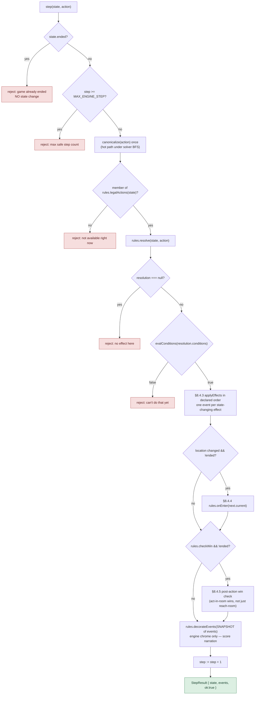
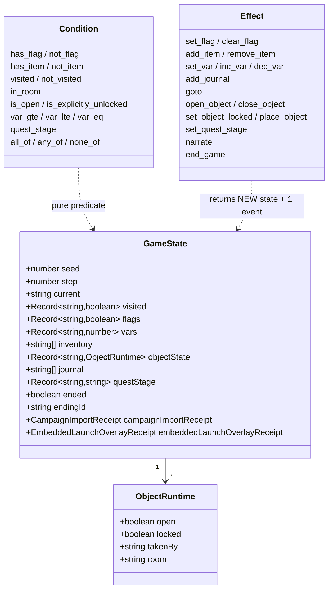
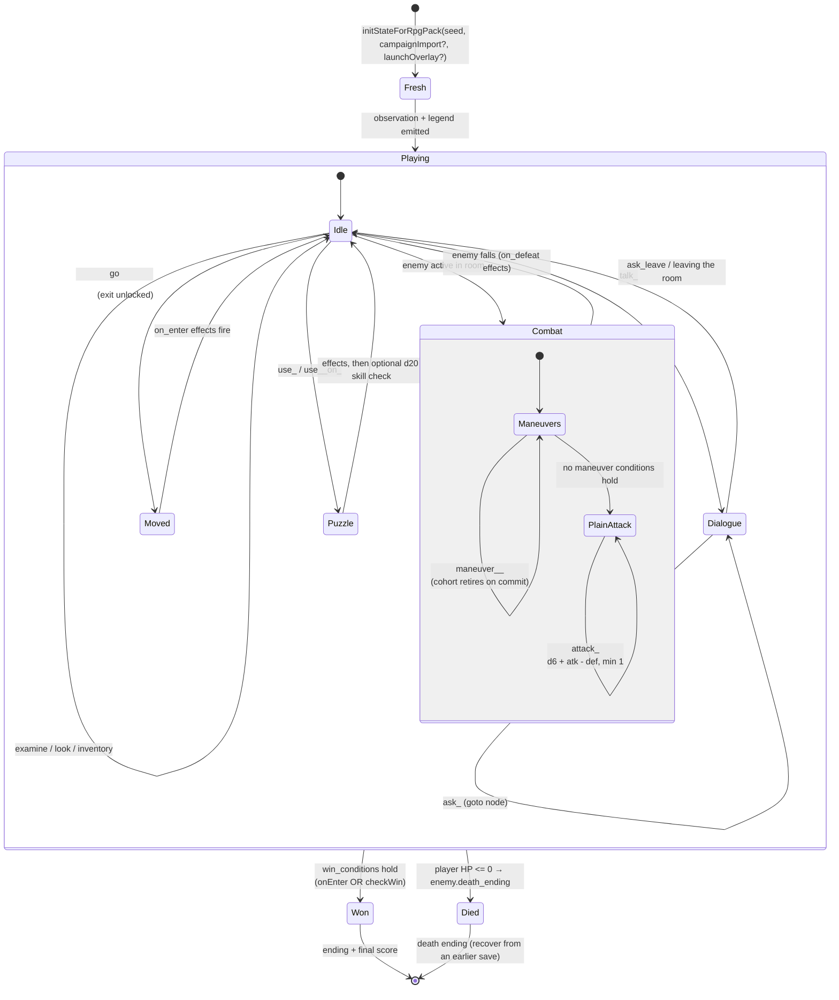
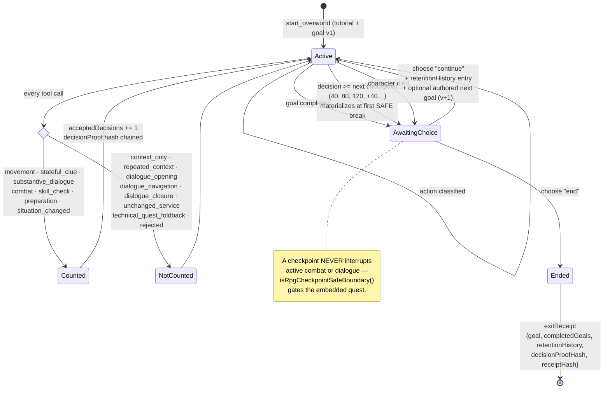
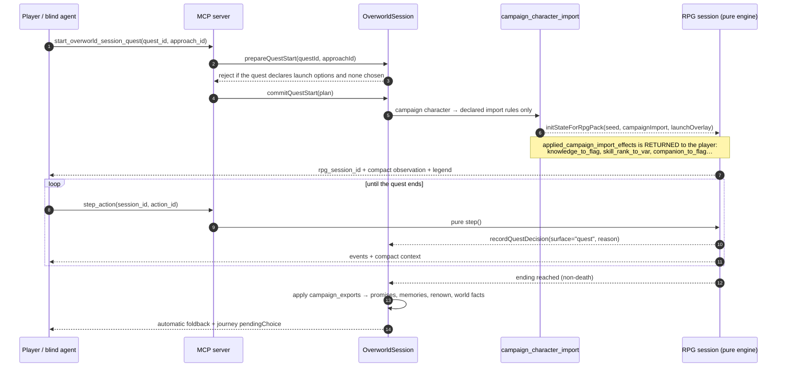
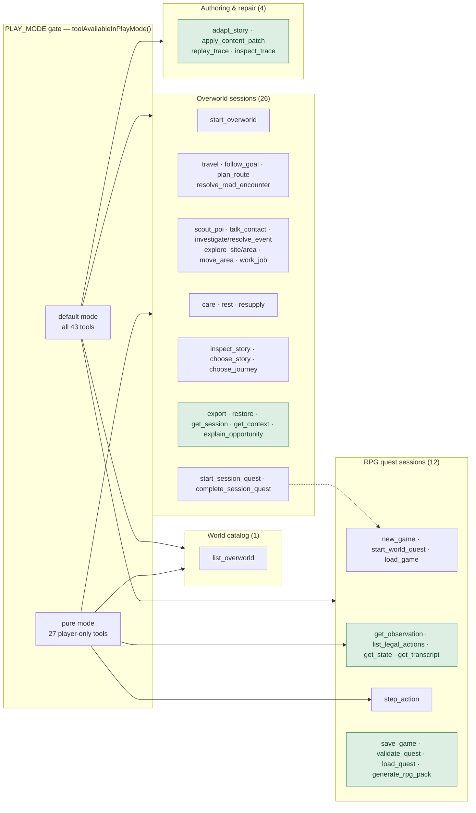
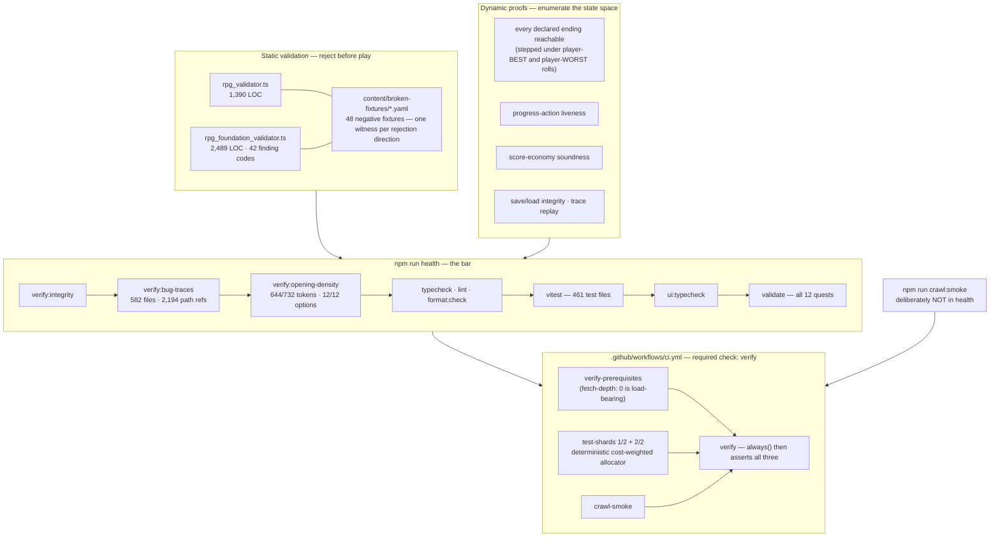
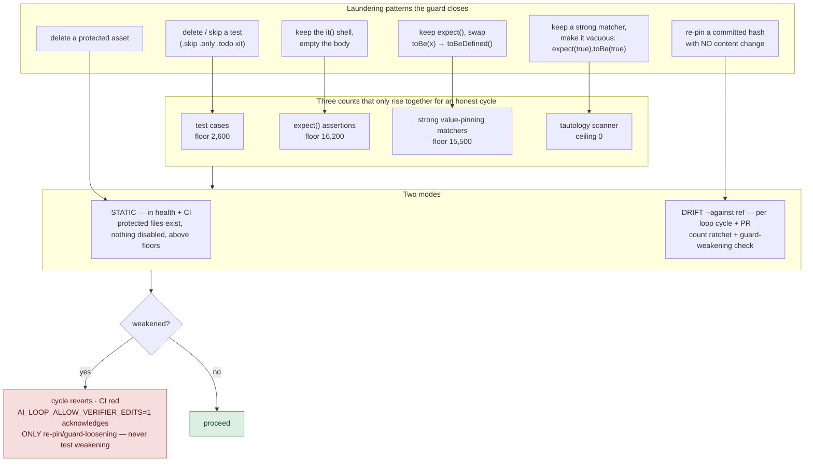

# AdventureForge — repository audit

Audit date: 2026-08-28 · Audited commit: `a485798` (`main`) · Method: full read of
`src/`, `bin/`, `scripts/`, `agents/`, `tests/`, `blind-tester/`, `ui/`, plus one
complete playthrough driven through the MCP server (`npm run mcp`).

> **Partly superseded (2026-08-29).** A second audit at `5ff3d0d8` — the commit that
> introduced this file along with the two-loop split, so the QA/intake subsystem was
> never in scope here — confirmed 81 findings, and the fix pass that followed closed
> 50 of them. Several findings below are now fixed: **F3** (tool-count drift; the
> group breakdown summed to 42 and is now 26 for overworld sessions), **F8** (the
> health bar's environment sensitivity is unchanged, but the five Windows failures
> folded into it were a real repo-root defect, now fixed), and the negative-fixture
> and finding-code counts, which were wrong in this document even at `a485798` and
> have been corrected in place (48 fixtures, 75 codes). **F1**, **F2**, **F4**,
> **F5**, **F6** and **F7** remain open.
>
> Measurements below are as-of `a485798` and are deliberately NOT restated: the
> corpus is 482 files / 4,335 tests today. Read this as a snapshot, not as current
> state.

---

## 0. What this repository is, in one paragraph

AdventureForge is a **deterministic text-RPG engine plus the machinery that
improves it without a human in the loop**. Roughly 80k lines of TypeScript under
`src/` split into two very different halves: a small, pure, immutable core
(`src/core`, ~1.5k lines) that a reducer walks one action at a time, and a large
stateful campaign layer (`src/world`, ~39k lines) that models an open-world
journey around it. On top sit three surfaces (MCP, CLI, React UI), and around the
whole thing a four-tier verification pyramid feeding an autonomous improvement
loop. The unusual part is not the game — it is that **verification is the
product's load-bearing structure**, deliberately hardened against the agent that
writes the code.

---

## 1. The repository as a whole

```mermaid
flowchart TB
    subgraph CONTENT["Content — data only, never code"]
        QUESTS["content/rpg/quests/*.yaml<br/>12 shipped quests"]
        WORLD["content/world/new_york_overworld.json<br/>247 nodes · 344 roads · 700 areas"]
        FIXTURES["content/broken-fixtures/*.yaml<br/>48 negative fixtures"]
        CORPUS["corpus/ + traces/<br/>sealed packs · 582 bug traces"]
    end

    subgraph ENGINE["Deterministic core — src/core (~1.5k LOC)"]
        STEP["engine.ts · makeStep(rules)<br/>pure reducer, no clock, no ambient RNG"]
        DSL["conditions.ts + effects.ts<br/>closed Zod-schema DSL"]
        RNG["rng.ts · seeded mulberry32 / splitmix64"]
        HASH["hash.ts · canonical JSON → SHA-256"]
    end

    subgraph RPG["RPG foundation — src/rpg (~4.6k LOC)"]
        RULES["runner.ts · Rules adapter<br/>legalActions / resolve / onEnter / checkWin"]
        LEGAL["legal_actions.ts · Jericho-style legal menu"]
        COMBAT["combat.ts · d6 rounds · maneuvers"]
        SKILL["core/skill_check.ts · d20 + skill vs DC"]
        SCHEMA["schema.ts · pack contract"]
    end

    subgraph WORLDL["Campaign / overworld — src/world (~39k LOC, 102 files)"]
        SESSION["session.ts · OverworldSession<br/>45 methods, ~35 mutable fields"]
        JOURNEY["journey_contract.ts · v3 decision + retention contract"]
        CAMPAIGN["journey_campaign.ts · goals, story choices, consequences"]
        SNAP["session_snapshot(_restore).ts · 3k LOC hand-rolled serialization"]
        CVIEW["compact_view.ts · token-budgeted projection"]
    end

    subgraph SURFACES["Surfaces — none of them decide legality"]
        MCP["src/mcp · 43 MCP tools over stdio"]
        CLI["bin/*.ts · play, overworld, validate, inspect, replay, crawl"]
        UI["ui/ · React + Vite over the same headless engine"]
    end

    subgraph VERIFY["Verification"]
        T0["Tier 0 · vitest 461 files + 2 validators (75 finding codes)"]
        T1["Tier 1 · src/crawl · 9 zero-LLM oracles"]
        T2["Tier 2 · blind-tester · pure LLM playtest + exit receipt"]
        T3["Tier 3 · src/feedback · hot spots + retention"]
        GUARD["scripts/verify-integrity.ts<br/>anti-reward-hacking guard"]
    end

    LOOP["loop.sh + src/afk · the AFK flywheel"]

    QUESTS --> SCHEMA
    WORLD --> SESSION
    FIXTURES --> T0
    CORPUS --> T0

    DSL --> STEP
    RNG --> STEP
    HASH --> STEP
    RULES --> STEP
    LEGAL --> RULES
    COMBAT --> RULES
    SKILL --> RULES
    SCHEMA --> RULES

    SESSION --> JOURNEY
    SESSION --> CAMPAIGN
    SESSION --> SNAP
    SESSION --> CVIEW
    SESSION -- "embeds a quest session" --> RULES

    MCP --> SESSION
    MCP --> RULES
    CLI --> SESSION
    CLI --> RULES
    UI --> SESSION
    UI --> RULES

    T0 --> LOOP
    T1 --> LOOP
    T2 --> T3 --> LOOP
    GUARD --> LOOP
    LOOP -. "one focused change per cycle" .-> CONTENT
    LOOP -. .-> ENGINE
    LOOP -. .-> WORLDL

    classDef data fill:#dde7f2,stroke:#3d6b96,color:#16212b
    classDef pure fill:#dcefe2,stroke:#3f8a5c,color:#14402a
    classDef big fill:#f6e6d5,stroke:#b07a3c,color:#4a3113
    class CONTENT,QUESTS,WORLD,FIXTURES,CORPUS data
    class ENGINE,STEP,DSL,RNG,HASH pure
    class WORLDL,SESSION,SNAP big
```

**The single most important structural fact:** the arrow from `MCP/CLI/UI` into
the engine is one-way. Every surface renders observations and submits action ids;
none of them decides what is legal. That is what makes the same engine playable by
a human in a browser, a CLI script, and a blind LLM through native tool calls,
with byte-identical results.

---

## 2. The deterministic core — how one action resolves

`src/core/engine.ts` is 157 lines and is the whole contract. Everything else in
the repo is content, adapters, or proof.



Three details worth calling out because they are unusually well-guarded:

- **`decorateEvents` receives a copy.** The one extension seam in the reducer
  hands out a snapshot array and appends the return value only if it is a
  different object — so a misbehaving decorator cannot splice the step's real
  events, and returning its own argument cannot duplicate them. Purity is
  *enforced*, not documented.
- **`canonicalize` uses a null-prototype accumulator.** A state carrying a key
  literally named `__proto__` (reachable across the untrusted-save boundary,
  since `JSON.parse` makes it an own property) would otherwise canonicalize to a
  string colliding with the same state *without* that key — silently breaking
  "equal hash ⇒ equal state" and the save-integrity check resting on it.
- **`rngForStep` keeps the legacy 32-bit derivation for seeds in `[0, 2^32)`** so
  every recorded trace still replays byte-identically, and falls to a real 64-bit
  SplitMix64 for signed/wide seeds where the old high-word XOR fold was not
  injective.

### The closed DSL



16 condition kinds, 17 effect kinds — both closed unions with `.strict()` Zod
schemas and an exhaustive `never` check at the bottom of each evaluator. Content
cannot introduce a new kind; only the engine can. This is what makes the static
validators able to reason about a pack *without running it*.

A subtle piece of naming discipline documented inline: `is_explicitly_unlocked`
is **not** the negation of "locked". It reads `objectState[id].locked === false`
with no static fallback, so it is false for an object that was never locked. The
validator's win-stability proof is built on that runtime-only reading; conflating
it with `isLocked` would silently change validator verdicts.

---

## 3. RPG quest session — the inner game



**Combat is choice-first, not buff-first.** While any maneuver's conditions hold,
the plain `attack_<enemy>` action is *suppressed*; committing a maneuver retires
its cohort and a surviving enemy may expose a child cohort next beat. Only when
no maneuver is available does the ordinary strike return. That is a deliberate
design decision encoded in `enumerateRpgActions`, and it is why my Wolf-Winter
fight read as tactics rather than as a damage race.

Both combat and skill checks narrate their arithmetic in full —
`d6 3 + 7 atk - 2 def`, `d20 14 + 4 = 18 vs 15 — success`. The inline comment
records exactly why: a blind playtester reported that a `+2 defense` item "felt
invisible" because only the final number was shown (`bug_0131`). The `min 1`
floor is stated honestly (`= -2, blunted to the floor of 1`) so the shown
breakdown can never fail to add up.

---

## 4. Campaign layer — journey contract v3

This is where most of the code lives, and where the design is most opinionated.



The decision classifier is the retention metric's definition, in code, shared
unchanged by UI and MCP. That is a strong move: reading the game's own transcript
and asking "was that a real decision?" is exactly the measurement you would
otherwise fudge in a spreadsheet.

I verified the whole loop live: goal completed at decision 27 → continue →
authored dawn-wagon story choice installed goal v2 → checkpoint fired at exactly
decision 40 → end → exit receipt with two `retentionHistory` entries and a
`receiptHash`.

### Crossing the campaign ↔ quest boundary



The boundary is **explicitly enumerated, not implicit**. The start response
carries a `scope_note` — *"Campaign history, supplies, and fatigue persist. Quest
HP, stats, and items stay local. Only listed transfers cross"* — plus the exact
rule ids that fired. In my run: `import:wolf_winter_fieldcraft` set quest-local
`defense` to 4, `import:wolf_winter_june_companion` set the `june_pike_present`
flag. On the way out, killing wolves after promising June cattle-first flipped
`albany:promise_june_cattle_first` to `broken` and wrote
`albany:memory_june_left_after_blood` into her relationship record. Consequence
modelling of that fidelity is rare.

---

## 5. MCP surface — how an agent actually plays



The observation format is the most quietly impressive engineering in the repo.
Responses are **positional tuples with a self-describing legend**: a
session-creating call ships a full `legend`, later calls ship `legend_delta`
entries defined *before* a field's first use, and dotted keys name exact nested
result paths (`result.areas`, `result.entry`). State-hash guards skip unchanged
payloads. `pending_road` even carries its own `next_action`:

```json
"next_action": { "tool": "resolve_overworld_session_road_encounter",
                 "argument": "strategy", "values_from": "options[*][0]" }
```

That is a protocol designed so a blind agent can play a long session inside one
context window — and it works. My 49-call playthrough never needed the repo.

---

## 6. Validation and the verification bar



**Tier 1 crawler oracles** (`src/crawl/findings.ts`), with fixed severities:

| Code | Severity | What it catches |
|---|---|---|
| `CRASH` | S4 | engine threw |
| `INTEGRITY` | S4 | state-reference integrity violated |
| `DESYNC` | S4 | observation disagrees with state |
| `PERSIST` | S4 | save→load round-trip diverged |
| `LEGALITY` | S3 | offered action rejected / legal action missing |
| `SOFTLOCK` | S3 → S4 | unwinnable; S4 when zero legal actions remain |
| `WORLD` | S3 | overworld coverage/consistency |
| `RENDER` | S2 | stale or contradictory prose |
| `ORPHAN` | S0 | unreachable content |

Findings are deduped, Zod-validated, and carry a **minimized replayable repro**.

---

## 7. The anti-reward-hacking guard

This is the part I would put in front of anyone building an autonomous coding
loop. `scripts/verify-integrity.ts` exists because the dominant failure mode of
unattended agents is not writing bad code — it is quietly weakening the check
that would have caught it.



The guard's own docstring is honest about its limit: *"An agent with write access
to this script could also edit the guard itself — the point is to make tampering
visible, effortful, and against the rules, not impossible."* The `fetch-depth: 0`
in CI is load-bearing for the same reason: drift mode needs the base tree, and a
shallow clone would let both real checks silently skip while still reporting OK.

---

## 8. The flywheel — one AFK cycle

```mermaid
sequenceDiagram
    autonumber
    participant L as loop.sh
    participant A as assessor (src/afk)
    participant AG as coding agent (Codex CLI)
    participant C as crawl:smoke
    participant H as health
    participant B as blind player (fresh LLM, no repo)
    participant F as feedback compiler

    L->>L: refuse to start on a dirty tree
    L->>A: npm run ai:loop
    A-->>L: ranked candidates (hot spots are a PRIMARY input)
    L->>C: crawl gate (PRE)
    C-->>L: green or halt+revert

    L->>AG: one focused change
    AG->>AG: focused checks → LOCAL provisional commit (never pushed)
    Note over AG: git status --porcelain must be EXACTLY empty<br/>before pure evidence starts

    L->>B: pure blind playtest on that exact commit
    B-->>L: V2 exit interview + runner sidecar bound to the clean HEAD

    L->>C: crawl gate (POST) — a new finding is YOUR regression
    L->>H: npm run health
    L->>L: verify:integrity --against cycle-start ref
    L->>L: require_playtest_record + require_final_ledger_only

    alt every gate green
        L->>L: seal report + manifest into AI_LOOP_STATE.md, ledger-only commit
        L->>F: (separately) feedback:compile when status says a delta is ready
    else any gate red
        L->>L: _revert_failed_cycle → hard reset to cycle-start ref<br/>+ remove cycle-created untracked paths
        L->>L: durable failure ledger; circuit breakers at 5 / 15
    end
```

Details that matter and are easy to miss:

- **Evidence is commit-bound.** A blind report only counts if its sidecar binds
  the exact clean provisional HEAD. You cannot play build A and claim it as
  evidence for build B.
- **A failed cycle self-heals.** Without the revert, one bad authored artifact
  stayed untracked and failed `health` on *every* subsequent cycle, wedging the
  loop to the circuit breaker with zero progress. The comment records that this
  was observed, not theorized.
- **A post-commit push failure must NOT revert** — the verified commit is real
  progress, and counting it as failure would let a protected-branch rejection
  trip the breakers.
- **The pyramid separates evidence classes rigorously.** Structural mocks stay
  *visible in accounting* but can never create product hot spots, satisfy the
  compile threshold, or enter retention. Historical contract versions (v1/v2/v3)
  are never pooled.

---

## 9. Live verification results (this audit)

| Check | Result |
|---|---|
| `verify:integrity` (static) | **OK** — 0 errors, 0 warnings |
| `verify:bug-traces` | **OK** — 582 YAML files, 2,194 concrete path refs (1,422 current, 771 historical) |
| `verify:opening-density` | **OK** — 644/732 word tokens, 12/12 actionable options |
| `typecheck` / `lint` / `format:check` | **OK** |
| `crawl:smoke` (Tier 1) | **OK** — 6,000 steps, **zero findings**; 12/12 quests, overworld 247/247 nodes · 344/344 edges · 12/12 boards |
| `validate` (12 shipped quests) | not reached — `health` stopped at the test step |
| **`npm test`** | **20 failed / 4,084 passed / 3 skipped** across 461 files — **every failure a timeout**, see F8 |
| **`npm run health`** | **exit 1** on this container, on timeouts only |
| MCP server | starts clean, **43 tools** registered |
| Full playthrough | Wolf-Winter completed **60/60**, `ending_held`; journey ended at decision 40 with a valid exit receipt |

> **Shallow-clone caveat:** on the depth-50 clone this session started with,
> `verify:bug-traces` reported **766 spurious `TRACE_REFERENCE_MISSING` findings**.
> Every one resolved after `git fetch --unshallow`. This is the exact failure mode
> CI's `fetch-depth: 0` comment predicts — worth knowing before anyone debugs it
> as a real regression.

---

## 10. Findings

Nothing here is a correctness defect in shipped gameplay. The engine, the
validators, and the loop all do what they claim. These are the places where the
repo's own standards are not yet applied evenly.

### F1 — The overworld is a stateful class, while the engine it wraps is a pure reducer (structural)

`src/core` proves its determinism by construction: immutable `GameState`, a pure
`step`, canonical hashing. `OverworldSession` is the opposite shape — one class
with **~35 mutable fields** (`Set`s, `Map`s, counters, `pendingRoadEncounter`,
`characterState`, `journeyState`, caches) and 45 methods, at 4,023 lines.

The cost is visible and measurable: `session_snapshot.ts` (884) plus
`session_snapshot_restore.ts` (2,118) are **3,002 lines of hand-rolled
serialization** that exist only because the state is not a plain value. Two bugs
recorded in the tree are directly attributable to that shape —
`inspectedStoryReveals` originally lived in a `WeakMap` keyed by the live session
object and was silently revoked on export/restore (its own comment says the gate
"lived deliberately outside the snapshot"), and `bug_0529` covers pure embedded
session recovery.

This is not a rewrite recommendation. It is the highest-leverage divergence
between the repo's stated architecture and half its code, and the natural place
for the workflow conversation to start.

### F2 — 701 world characters share 18 distinct names (content honesty)

Measured directly from `content/world/new_york_overworld.json`:

| Collection | Rows | Distinct values |
|---|---|---|
| `characters.name` | 701 | **18** (each repeats ~44×) |
| `local_events.summary` | 700 | 682 strings → **29 template skeletons** |
| `road_events.title` | 344 | 19 |
| `areas.name` | 700 | 682 |

I met "Rowan Quill" as Albany's records clerk and then met *Rowan Quill again* as
Queensbury's records clerk 60 in-game minutes later. The README is careful here
("the rest of the node count should not be read as 247 equally authored
locations"), so this is not a false claim — but the gap between the authored
Albany chapter and the procedural remainder is wider than the headline numbers
suggest, and the name collision is the first thing a player notices.

### F3 — Tool-count drift in the README (documentation)

`README.md` says **"42 tools, in four groups"** with the breakdown 1 + 25 + 12 + 4.
The server registers **43**, and the overworld group is **26** (`restore_overworld_session`
is absent from the README's enumeration while `export_overworld_session` is
listed). Given how much of this repo is held to exact byte counts and hash pins,
a hand-maintained tool count in the README is an odd soft spot — `TOOL_REGISTRATIONS`
is already exported for tests to assert against.

### F4 — `inspect_overworld_session_story` and `choose_overworld_session_story` disagree on their option parameter (API ergonomics)

```
inspect_overworld_session_story(story_choice_id, option_id?, reveal_id?)
choose_overworld_session_story(story_choice_id?, choice)      ← not option_id
```

Inspecting an option and then choosing it — the exact flow the tool descriptions
recommend ("To see full terms, inspect one option") — requires renaming the
argument between two adjacent calls. I hit this immediately as a first-time
player and got `Invalid arguments … Required at choice`. The failure is loud and
recoverable, but it is friction on the single most-used authored-choice path.

### F5 — Quest-launch approach selection is discoverable only through the legend (UX)

`context.quests[]` embeds a launch tuple shaped exactly like a story choice —
`["albany:wolf_hill_approach", prompt, [options…], selected|null]` — with an id
that reads like a `story_choice_id`. Calling
`choose_overworld_session_story` with it returns *"Departure story choice … is
not available at the current location and journey boundary"*, and
`start_overworld_session_quest` without it returns *"Choose an approach before
starting The Wolf-Winter."* Neither message names the actual mechanism, which is
the `approach_id` **parameter** of `start_overworld_session_quest`.

The information *is* correct and present — the `quests` legend spells out the
whole flow, and `quest_starts` lists exactly the legal `(quest_id, approach_id)`
pairs. But a player who reads the error rather than re-reading the legend has no
path forward from the error text alone. Adding the tool name to that rejection
would close it.

### F6 — Two `src/world` files exceed 2,000 lines; `src/mcp/server.ts` is 2,291 (maintainability)

`session.ts` 4,023 · `overworld.ts` 3,749 · `session_snapshot_restore.ts` 2,118 ·
`server.ts` 2,291 · `fleet_certifier.ts` 2,757 · `journey_contract.ts` 1,861 ·
`compact_view.ts` 1,779. `overworld.ts` is defensible — it is mostly Zod schema
declarations. The others are behavioural. For a codebase edited primarily by
agents working under a token budget (an explicit `AGENTS.md` concern: *"prefer
targeted rg … over broad whole-file dumps"*), these files are the ones where that
guidance is hardest to follow.

### F7 — Property-based testing is thin relative to the rest of the pyramid (test balance)

461 test files break down as 236 regression · 175 unit · 43 starting-slice ·
3 acceptance · **2 property**. `fast-check` is a declared dependency. Given that
the core's central claims are *universally quantified* — "same seed ⇒
byte-identical run", "equal hash ⇒ equal state", "effects never mutate input" —
this is the tier with the most headroom. The two property files that exist
(`determinism.test.ts`, `overworld_determinism.test.ts`) are both in
`PROTECTED_FILES`, which shows the project already knows they carry outsized
weight.

---

### F8 — The health bar's test suite is environment-sensitive, and fails on timeouts alone under load

`npm run health` **exited 1** on this container. That is the finding — not a
gameplay defect, but a defect in the instrument the whole flywheel trusts.

| | |
|---|---|
| Files | 461 · **11 failed**, 450 passed |
| Tests | 4,107 · **20 failed**, 4,084 passed, 3 skipped |
| Wall clock | **6,414 s (1 h 47 m)** — of which `import` alone was **4,339 s** |

**Every one of the 20 failures is a timeout**, in two shapes:

- 12 × `Test timed out in 60000ms` / `120000ms`
- 8 × `spawnSync /opt/node22/bin/node ETIMEDOUT` in subprocess-spawning CLI
  tests, several reporting exit `143` (SIGTERM)

Not one is an assertion about behaviour. I confirmed the diagnosis directly by
re-running one of the failing files with the ceiling raised:

```
npx vitest run --project standard --testTimeout=600000 \
  tests/unit/world_campaign_service_rules.test.ts
→ Test Files 1 passed (1) · Tests 14 passed (14) · Duration 96.11s
```

14/14 green, in 96 s — against a 60 s per-test ceiling. The failing files
cluster exactly where you would predict: **8 of the 11 spawn a child `node`
process** (`overworld_cli`, `rpg_play_world_source`, `trace_cli_integrity`,
`crawl_workers_determinism`, `feedback_rebootstrap_cli`,
`blind_runner_config_contract`, and two starting-slice counterfactuals).

Why this matters more than an ordinary flake:

1. **`health` is the bar**, and `loop.sh` reverts the entire cycle when it is
   red (`_reject_cycle "health"`). A timing-sensitive bar means an autonomous
   cycle can lose real work to machine load rather than to a defect — and the
   durable failure ledger will record it as a health failure, indistinguishable
   from a genuine one.
2. **The circuit breakers count these.** `AI_LOOP_MAX_CONSECUTIVE_FAILURES=5`
   is five contended runs away from halting the loop.
3. **CI already mitigates this and `health` does not.** `ci.yml` shards tests
   across two runners with a cost-weighted allocator; a local or cloud
   `npm run health` runs all 4,107 serially in one process tree.

A per-test timeout is a proxy for "this hung", but these tests genuinely need
more than 60 s of CPU on a loaded machine. Raising the ceilings for the
subprocess-spawning group — or giving them a `hangTimeout` distinct from the
unit-test default, the way `test:coverage` already carries its own
`--testTimeout=300000` — would make a red `health` mean what it is supposed to
mean.

One incidental confirmation: the failing assertion in
`blind_runner_config_contract.test.ts` printed its own captured output,
`• tools/list → 43 tools`. The test agrees with the server and with F3 — the
README's "42" is the outlier.


## 11. What is genuinely excellent

To keep the findings in proportion:

- **The reducer is small, pure, and provably so.** 157 lines, one extension seam,
  and that seam is defended against its own hook.
- **Comments explain *why*, with evidence.** Almost every non-obvious line cites
  the bug that motivated it (`bug_0060`, `bug_0131`, `bug_0190`, `bug_0258`).
  582 bug traces with 2,194 verified path references, checked on every health run.
- **Rejection directions have witnesses.** 48 negative fixtures, data-driven, one
  per validator finding code — so "the validator would have caught it" is a test,
  not a claim.
- **Evidence classes are never mixed.** Structural mocks, legacy reports, and
  pure retention evidence are separated at the schema level, and contract
  versions are never pooled.
- **The observation protocol is a real contribution.** Positional tuples +
  incremental legend + state-hash skip + embedded `next_action` hints is a better
  answer to "how does an LLM play a long game" than anything I have seen bolted
  onto a text engine.
- **The loop is honest about its own limits.** The ledger repeatedly writes
  sentences like *"One AI canary is not causal lift, human validation, a passing
  fresh pilot, or certification."* An autonomous system that files its own
  counter-evidence is doing something right.
