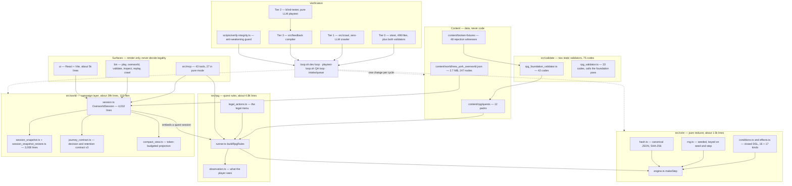
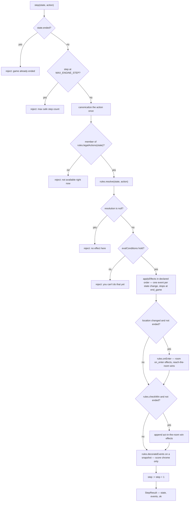
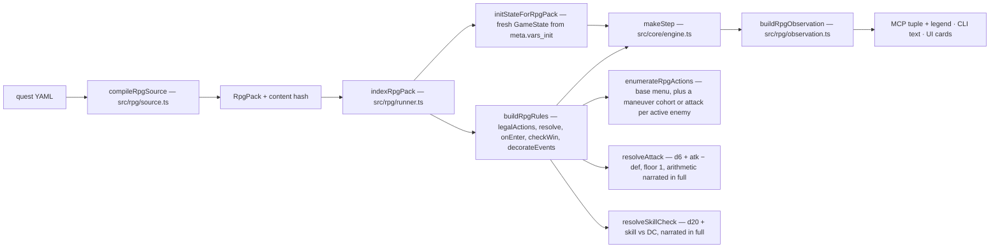
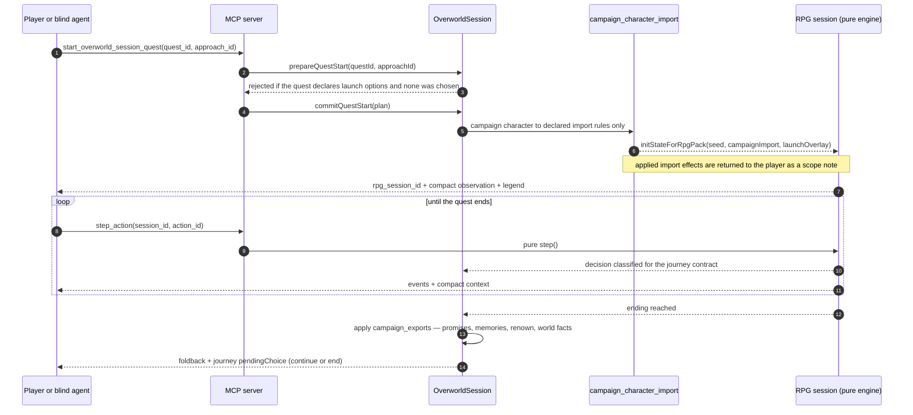
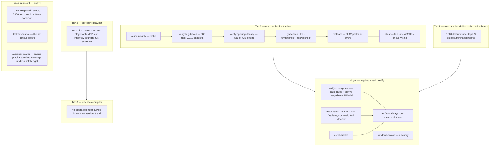
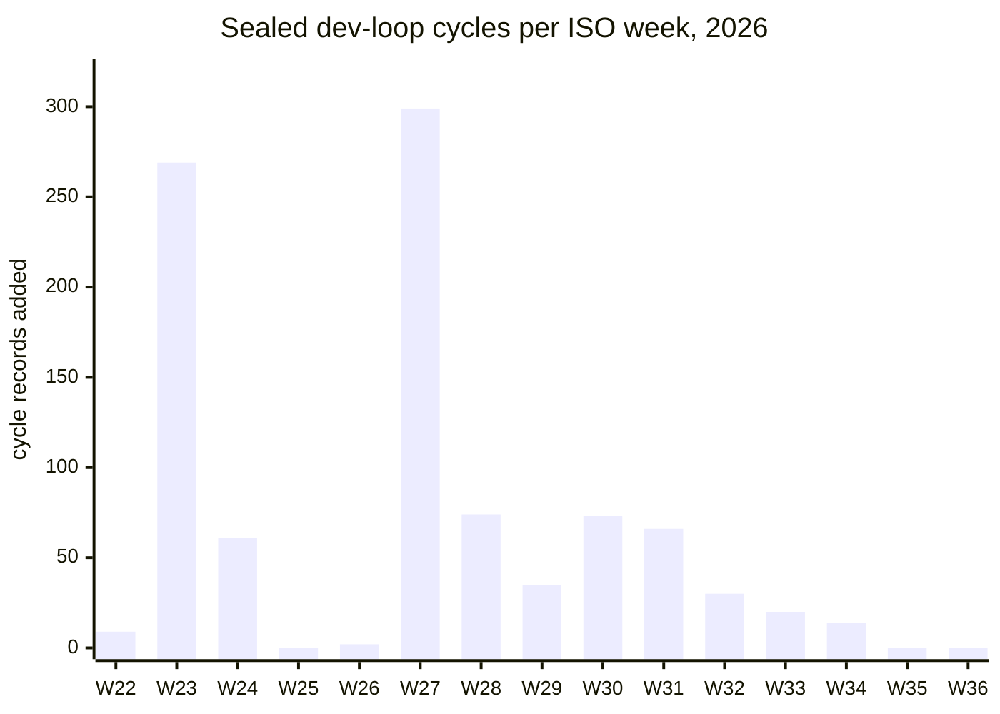

# AdventureForge — repository review and audit, 2026-09

Audit date: 2026-09-05 · Audited commit: `700e523` (`main`) · Previous audit:
[`REPO_AUDIT_2026-08.md`](./REPO_AUDIT_2026-08.md) (the status of its findings is in
Appendix A).

Method: a full read of the charter, README, and the process docs; a direct read of
`src/core`, `src/rpg/runner.ts`, `loop.sh`, `scripts/verify-integrity.ts`, the two
workflows, and the intake queue; four parallel subsystem reads (the world layer, the
MCP server and playtest pipeline, the dev-loop driver and verifier, the RPG engine
and validators and UI) whose highest-impact claims were then re-verified by hand
against the code; live runs of every cheap gate, `crawl:smoke`, and the fast test
lane on a 4-core / 15 GB Linux box; the GitHub Actions history of `ci.yml` and
`deep-audit.yml`; and the full git history (1,653 commits since 2026-05-31, after
unshallowing the clone this session started with).

This document is deliberately opinionated about impact. Anything that would not
change what a maintainer does next was left out.

---

## 0. The short version

The engine is in good shape. The pure core, the closed DSL, the validators, the
census proofs, the crawler, and the evidence-binding rules all do what they claim,
and every gate is green on `main` today. The problems are in the machine built
around the engine, and the biggest one is that the machine has stopped.

| # | Problem | What to do |
| --- | --- | --- |
| 1 | **The flywheel has stalled.** Sealed dev-loop cycles per week went 269 → 299 → 66 → 20 → 14 → **0 → 0**; the last sealed cycle is 2026-08-22, the accepted feedback compile from that day is still unconsumed, and the last fifteen cycles each spent hours of verification on a few hundred bytes of prose that never moved the pilot gate (clarity 38–40 of 50, every time). Meanwhile 65 commits landed by hand and by bots, and the intake queue holds 48 open items including a P0 from 2026-08-29. | Make a cycle cheap again (finding 2), measure the pilot gate's own noise before spending on it again, and drain the queue's already-written fixes in one owner-approved batch (finding 5). |
| 2 | **The bar is too slow and too load-sensitive for a machine to run, and on a 4-core box it is red today.** The fast lane took 54 min 48 s here and failed 10 of 492 files, every failure a timeout, while the same commit was green on GitHub's runners; 63% of files cost 1.5% of the lane; 117 test files each re-validate the 2.7 MB world (69 minutes of summed worker time, a third of the lane); one file sets a 13–22 minute floor; timeouts are a flat 60 s; the CI cost table is frozen from July and wrong in both directions. | Land the census's own two recommendations (validate the world once: −31%; split the four files that set the floor), size timeouts from measured cost per file, and make the lane's wall clock a gate so it cannot drift again. |
| 3 | **CI cancels its own post-merge check on main.** `cancel-in-progress: true` applies to push events too, so the "drift vs previous tip" step that exists to catch an admin direct push (branch protection has `enforce_admins` off) was cancelled on 6 of the last 15 `main` runs. | One line: `cancel-in-progress: ${{ github.event_name == 'pull_request' }}`. |
| 4 | **Playtest evidence can still be forged or lost.** A hand-written JSON record can be stamped `runner_enforced` and move the experience metrics that gate the milestone (P0, open); model-authored strings flow unbounded into tracked files; the intake claim is a read-modify-write with no lock; and the playtest loop hard-resets away its own triage output every wave. | Only the runner mints `runner_enforced`, bound to its sidecar hash; `.max()` the free-text fields; stage-and-rename queue writes; run playtest-side triage as a dry run. |
| 5 | **The anti-weakening guard has two holes it does not name, and it is blocking a proven fix.** Nothing checks a changed expected literal in the 494 non-hash-pinned test files; raw count floors reward padding (bot PRs adding tests for string helpers count exactly like census proofs); and a HIGH-severity scoring exploit whose fix is already written has sat in the queue since 2026-08-29 because landing it re-pins one trace hash, which needs an owner acknowledgement nobody has given. | State the limit in the guard's docstring and report changed test literals in drift mode; protect the three unprotected verifier inputs; replace raw count floors with a per-file import rule; decide the one re-pin now and adopt a rule for the next one. |
| 6 | **The campaign layer's determinism and structure lag the core.** Its road and lead ordering uses bare `localeCompare` in 29 places, so the same seed produces a different player-facing road order on a Lithuanian or Czech host (reproduced here; the property test is structurally blind to it). The hash primitive under it collapses `Map`, `Set`, and `Date` to `{}`. The 39k-line mutable class around the 1.5k-line pure core is the previous audit's F1, unchanged; it now carries twelve import cycles, 423 file-private exports, a six-way copied opening module, and this week's memoization PR leaked a shared cache and needed a follow-up two days later. | Ban bare `localeCompare` by lint and pin `LC_ALL=C` for tests; make `canonicalize` throw on non-plain objects (three lines); break one import edge and delete the dead exports; keep moving session state into the snapshot, one `Set`/`Map` field at a time. |

Findings 7–10 (advertised-but-absent engine capabilities, prose-pinned tests, the
world's 18 character names, and four driver hazards) are smaller and are listed in
§5 with the same evidence-and-fix shape.

---

## 1. What this repository is

AdventureForge is a deterministic text RPG engine plus the machinery meant to improve
it without a human in the loop. Under `src/` there is a small pure core (`src/core`,
~1.5k lines) that a reducer walks one action at a time; a quest layer (`src/rpg`,
~4.8k lines) that turns a YAML pack into rules for that reducer; a large stateful
campaign layer (`src/world`, ~39k lines in 103 files) that models an open-world
journey around one authored opening; three surfaces (MCP, CLI, React UI) that render
observations and never decide legality; and a four-tier verification pyramid feeding
two autonomous loops. Content is data: 12 quest packs, one 2.7 MB world graph, and 48
negative fixtures. The verification is the load-bearing structure, and it is
deliberately hardened against the agent that writes the code.

The one structural fact everything else depends on: the arrows from the surfaces into
the engine are one-way. The UI's `choose` checks membership in the legal set and then
calls the same `makeStep` the MCP server and the CLI call; the engine re-checks
legality itself. That is what lets a browser, a script, and a blind LLM play the same
game with byte-identical results.

---

## 2. How play works

### 2.1 One action through the engine

`src/core/engine.ts` is 157 lines and is the whole contract. `makeStep(rules)` returns
the pure `step(state, action)`; nothing else mutates a `GameState`.

Three details are unusually well guarded and worth knowing before touching the core:
`applyEffects` stops at the first `end_game`, so a list that ends the game cannot keep
mutating it; `decorateEvents` receives a copy, so the one extension seam cannot splice
the step's own events; and `canonicalize` uses a null-prototype accumulator so a state
carrying a key literally named `__proto__` still hashes distinctly. The seeded PRNG is
keyed on `(seed, step)`, so replay from any entry point reproduces the same rolls.

### 2.2 From a YAML pack to an observation

A quest pack is one `.strict()` Zod object with seven top-level keys: `meta`, `rooms`,
`objects`, `npcs`, optional `pressure_tracks`, `win_conditions`, `endings`, and
`enemies`. There is no `quests:` block; quest stages are just a `questStage` map written
by `set_quest_stage` and read by `quest_stage`. Conditions (16 kinds) and effects
(17 kinds) are closed unions owned by `src/core`, which is exactly what lets the static
validators reason about a pack without running it. The dependency is one-directional:
`src/rpg` imports `src/core` in dozens of places; `src/core` imports nothing from
`src/rpg`, `src/world`, or `src/validate`.

Combat is choice-first: while any maneuver's conditions hold, the plain attack is
suppressed; committing a maneuver retires its cohort; the ordinary strike returns only
when nothing tactical is available. Both validators are layered rather than
historical duplicates: `rpg_validator.ts` calls the foundation pass while injecting the
flags and items combat and skill checks grant at runtime, so a gate a fight opens is
not mis-flagged. Their only shared code is `END_GAME_UNDECLARED`, emitted from the two
places the other pass never traverses.

Winnability is proven two ways. Statically, conservatively, and labelled as such:
reachability ignores exit conditions, combat winnability is a lower bound under best
stats and luckiest rolls. Dynamically, by six census proofs that BFS the complete
reachable region of every shipped pack through the real `makeStep`, under two rule
sets that force the player's best and worst rolls. Every proof asserts
`cappedOut === false` against caps of 400k–800k states, and
`tests/regression/exhaustive_endings_cap_backstop.test.ts` witnesses the cap flipping
on a synthetic 502-state chain, so a pack cannot outgrow its proof silently. This is
among the best-engineered parts of the repository and needs nothing.

### 2.3 The overworld and the quest bridge

The New York overworld is both the world and the quest registry: 247 nodes, 344
roads, 12 notice boards, one authored Albany opening, and 12 quests that are reached
in-world. `OverworldSession` (`src/world/session.ts`) holds the journey; an embedded
quest is a pure RPG session that the overworld starts, observes, and folds back.

Every overworld session carries one versioned journey contract shared by the UI and
the MCP surface. Movement, new clues, substantive dialogue, combat, skill checks,
preparation, and authored story choices advance a decision counter; context-only reads,
dialogue navigation, rejections, and persistence do not. Goal completion and fixed
checkpoints (40, 80, 120, then every 40) present a continue-or-end choice at the first
safe break, and `isRpgCheckpointSafeBoundary` (`src/rpg/runner.ts`) keeps a checkpoint
from interrupting combat or dialogue inside an embedded quest. The exit receipt records
the goal history, the retention choices, and a hash-chained decision proof, which is
what the pure blind playtest's exit interview is verified against.

Inside `src/world` the shape is one stateful façade class delegating to about a
hundred pure helper modules: 27 exported `plan*` and 52 exported `apply*` functions
carry the reducer discipline of `src/core`, but only inside the helpers; the class
itself mutates. The two engines never call each other at runtime. `src/world` imports
`src/rpg` only for schema types and vice versa; the real bridge is `src/mcp/tools.ts`,
which takes the campaign imports out of the world session and hands them to
`initStateForRpgPack`.

| Sub-system | Key files (lines) | Entry points |
| --- | --- | --- |
| Manifest and schema | `overworld.ts` (3,711), `source.ts` (468) | `parseOverworldManifest`, `loadOverworldManifest` |
| Session façade | `session.ts` (4,032), `session_indices.ts` (212) | `class OverworldSession`, more than 40 public methods |
| Serialization | `session_snapshot_restore.ts` (2,124), `session_snapshot.ts` (884), `session_resource_replay.ts` (805) | `snapshot`, `snapshotHash`, `restore` |
| Views | `compact_view.ts` (1,780), `session_view_state.ts` (542), `session_view.ts` (281) | `compactView`, `view` |
| Journey contract | `journey_contract.ts` (1,859), `journey_campaign.ts` (1,352) | `recordJourneyDecision`, `recordJourneyGoalCompleted` |
| Travel and encounters | `session_routes.ts`, `travel_mechanics.ts`, `session_road_encounters.ts` | `travel`, `planRoute`, `resolveRoadEncounter` |
| Local actions | `session_local_actions.ts` (460), `session_local_action_journal.ts` (1,166) | `scoutPoi`, `exploreArea`, `workLocalJob`, `talkToCharacter` |
| The Albany opening | 25 `opening_*.ts` files (5,487 lines), six near-identical triads | registration, relief oath, lead source, preparation, relief allocation, ally |
| Consequences and renown | `campaign_consequences.ts` (745), `campaign_service_rules.ts` (540) | `replayQuestCampaignConsequences` |
| Quest bridge | `session_quests.ts` (545), `quest_launch.ts` (320), `quest_dispatch_window.ts` (498) | `prepareQuestStart`, `commitQuestStart`, `completeQuest` |

Test coverage of this layer is strong on paper: 92 of the 103 modules have at least
one test importing them directly, and only 1,399 lines (3.5%) do not. The one
untested module that matters is `session_indices.ts`, which builds every index the
session reads and owns 9 of the 29 `localeCompare` calls discussed in finding 6.

### 2.4 The surfaces

- **MCP** (`src/mcp/server.ts`, 2,390 lines, plus tested transport-independent handlers in
  `src/mcp/tools.ts`): 43 tools in four groups (world catalog 1, overworld sessions 26,
  RPG quest sessions 12, authoring and repair 4). Pure play mode exposes 27 player-only
  tools and refuses the rest at registration. Sessions are in-memory, strict LRU at 64
  each, with eviction under test. Responses are positional tuples with a self-describing
  legend: a session-creating call ships about 2.6 KB of legend (48% of a 5.4 KB
  `start_overworld` response) instead of the full 10.4 KB catalogue, and later calls
  add `legend_delta` entries before a field's first use; `tests/unit/compact_legend.test.ts`
  holds the scheme to those bounds.
- **CLI** (`bin/`): play, overworld, validate, inspect, replay, crawl, and the process
  tooling (`work`, `submit`, `doctor`, `triage`, `feedback`).
- **UI** (`ui/src`, 23 files, 5,050 lines): imports 17 engine modules directly and
  re-derives nothing; `ui/src/engine.ts` is React-free so it is unit-tested in Node.
  The React components themselves (`App.tsx` is 1,749 lines) have no direct tests.
  `npm run ui:typecheck` is clean at this commit.

---

## 3. How the machine improves itself

### 3.1 Two loops and one inbox

```mermaid
flowchart LR
  subgraph DEV["Dev loop — loop.sh, never plays"]
    A1["read intake queue: npm run work"]
    A2["assess: npm run ai:loop writes the cycle prompt"]
    A3["crawl:smoke — pre gate"]
    A4["agent turn: one focused change, provisional commit"]
    A5["crawl:smoke — post gate"]
    A6["npm run health — nine checks"]
    A7["verify:integrity --against cycle-start ref"]
    A8["seal feedback acceptance, ledger-only commit, optional push"]
    A1 --> A2 --> A3 --> A4 --> A5 --> A6 --> A7 --> A8
  end

  subgraph QA["Playtest loop — playtest-loop.sh, never edits code"]
    B1["fetch and hard-reset to the published build"]
    B2["run a wave: blind-tester/run.sh per player, pure MCP surface"]
    B3["verify each report against server-authored run evidence"]
    B4["record sealed sessions: bin/record-playtest-session.ts"]
    B5["triage clusters: bin/triage.ts"]
    B1 --> B2 --> B3 --> B4 --> B5
  end

  Q[("intake/queue — the one inbox: playtest, audit, human, research")]
  FB["src/feedback compile — hot spots, retention, manifest"]

  B5 -- "corroborated findings" --> Q
  Q --> A1
  B4 -- "verified reports" --> FB
  FB -- "accepted manifest sealed in AI_LOOP_STATE.md" --> A2
  A8 -- "green main" --> B1
```

The dev loop's cycle is defined by `run_cycle` in `loop.sh` (lines 514–659), with every
gate failing explicitly and reverting to the cycle-start ref plus an exact untracked-path
delta. Evidence is commit-bound: a blind report counts only if its sidecar binds the
exact clean provisional HEAD. The seal step verifies a cycle playtest if one was
published and no longer requires one, so any agent that reads STDIN, edits files, and
exits nonzero can drive a cycle (`dev-agents.json` lists `codex`, `claude`, `gemini`).

### 3.2 The verification pyramid and CI

The verifier (`scripts/verify-integrity.ts`, 1,631 lines) protects 17 assets by hash or
existence, enforces four count floors (2,975 test cases, 18,700 assertions, 17,900
strong matchers, 0 tautologies), and in drift mode ratchets those counts against the
cycle-start ref and refuses edits that lower a floor or shrink a protected list. Its
own docstring says the point is to make tampering visible and effortful, not
impossible; §5 finding 5 is about where visibility currently stops.

---

## 4. Live results on this box

| Check | Result (4 cores, 15 GB, Node 22.22) |
| --- | --- |
| `verify:integrity` (static) | OK, 0 errors, 0 warnings |
| `verify:bug-traces` | **FAILED on the shallow clone this session started with** (one `GIT_HISTORY_TRUNCATED` finding, 771 refs unadjudicated); OK after `git fetch --unshallow`: 586 files, 2,219 refs |
| `verify:opening-density` | OK, 581 of 732 word tokens, 12 of 12 actionable options |
| `typecheck`, `lint`, `format:check`, `ui:typecheck` | OK |
| `validate` (12 quests) | OK, 0 errors, 0 warnings, content hashes unchanged |
| The eight cheap gates together | 2 min 34 s wall clock |
| `crawl:smoke` | OK: 6,000 steps in 50.7 s (118 steps/s), 0 findings; overworld 247/247 nodes, 344/344 edges, 12/12 boards, 12/12 quests entered |
| `test:fast` | **Red on this box, on timeouts alone.** 54 min 48 s wall clock at four workers over 492 files: 10 files failed, 482 passed; 17 tests failed, 4,483 passed, 3 skipped. Every failure in the captured output is `Test timed out in 60000ms` or `spawnSync node ETIMEDOUT`, in `overworld_cli`, `inspect_death_ending_diagnosis`, `trace_cli_integrity`, `blind_runner_config_contract`, `overworld_cli_embedded_journey_bridge`, `rpg_play_world_source`, `world_campaign_service_rules`, `cade_return_packet_counterfactual`, `ally_commitment_counterfactual`, and `rpg_validation_bar`. Re-running only those ten files (15 min 44 s) failed the same ten again with 14 timeouts. Run one at a time with the ceiling raised to 600 s, `world_campaign_service_rules` passes 14 of 14 in 91 s and `trace_cli_integrity` passes 10 of 10 in 142 s: the tests are correct and the ceiling is what fails. The same commit passed both CI shards on GitHub's runners in 17 and 35 minutes. |
| CI on `main`, last 15 runs | 9 success, 6 cancelled by the concurrency group, 0 failures |
| Deep audit, last 12 nightly runs | 12 of 12 success, latest 2026-09-04 on `fff2ec6` |

The shallow-clone failure is worth one sentence because it is the first thing a new
agent or a cloud runner hits: the trace verifier now diagnoses it correctly (one
finding naming the remedy, instead of 771 false accusations), but `npm run health` is
still red on a depth-limited checkout, and `npm run doctor` does not mention it.

---

## 5. Findings

Ranked by impact. Each carries the evidence it rests on and the fix that would
actually move the number.

### 1. The flywheel has stalled, and it stalled because a cycle got too expensive

**Evidence.**

- Sealed cycle records added to `AI_LOOP_STATE.md`, per ISO week, from git diffs of
  that file over the full history:

  W34's 14 arrived in one squash on 2026-08-22 (`126eb03`, PR 301). Nothing has been
  sealed since. The machine-owned marker `historical_cycle_count` stands at 789.
- The accepted feedback compile in the ledger is dated 2026-08-22 and its
  `consumed_by_run_id` is still `null`.
- Since 2026-08-22, 65 commits reached `main`: the two-loop split and its follow-ups,
  three audit fix passes, the Linear mirror, catalog refactors, the test-lane split,
  and, on 2026-09-03/04, fourteen bot-authored PRs (Jules) adding unit tests, memoizing
  lookups, and removing unused exports. None of them is a loop cycle.
- The intake queue holds 59 submissions: 48 open, 11 done; 38 of them are audit
  findings. The open P0 (`P0-audit-7e920b74962d7f38`, evidence forgery) is from
  2026-08-29. `qa/tickets/` was emptied on 2026-09-03 because all 633 tickets had aged
  out unread, and the automatic playtest-to-intake promotion path has never fired for
  any vendor (recorded in PR 316's own message; all 17 playtest submissions were filed
  by hand).
- What the last fifteen sealed cycles did, from their own records: each changed one
  small content surface ("exactly ten prompt scalars", "432 ASCII bytes → 286", "only
  the three revealed Station `inlinePurpose` cells"), and each was verified by a
  10-player Terra pilot, two 6,000-step smoke crawls, a 224,000–1,536,000-step deep
  crawl, a 461-file health run, browser QA at two viewports, and one pure blind
  playtest. The pilot gate they were chasing read clarity **39, 40, 40, 39, 39, 39, 40,
  40, 40, 40, 39, 38** of 50 across those cycles and enjoyment 40–42 of 50. It never
  moved, and neither did the milestone (`docs/STARTING_SLICE.md` remains
  `active_unproven`, and the roadmap freezes all other content behind it).
- Each cycle record averages 2,610 bytes against a prompt that asks for "≤8 lines";
  the ledger the prompt tells every agent to read is 42 KB. The overflow check counts
  entries, not bytes.

**Why it matters.** The charter's thesis is that quality compounds through the loop.
Right now the loop produces nothing, the queue it is supposed to drain grows, and the
verification apparatus built to keep the loop honest is what made a cycle cost hours.
The two-loop split correctly removed the per-cycle playtest, but the remaining bar is
still about an hour on the fast lane alone (finding 2), and the cycle prompt still
frames the work as the smallest safe content edit.

**Fix.**

1. Make a cycle cost minutes, not hours: finding 2 in full. A loop that ran 40 cycles a
   day in June cannot run on a 54-minute lane.
2. Calibrate the gate before spending on it again. Run the same 10-player pilot three
   times on one frozen build and record the spread of clarity and enjoyment. If the
   test-retest band is ±2 (which twelve readings between 38 and 40 across twelve
   different builds strongly suggest), then 39 versus the 40 threshold is noise, and
   the milestone should be gated on things the loop can move and measure — specific S1
   findings closed, stuck rate, completion, strategy diversity — not on a 5-point mean
   over ten samples.
3. Drain the queue's written fixes in one owner session: the take_effects fix
   (finding 5), the P0 recorder fix (finding 4), the two Windows-path items, and the
   record-keeping items. Most are one commit each; what they lack is an approval, not
   an implementation.
4. Enforce the ledger's own terseness with a byte cap in `detectLoopStateOverflow`
   (currently entry-count only), so the 42 KB every cycle reads shrinks to the
   ≤8-line contract it already states.

### 2. The bar is too slow and too load-sensitive for a machine to run

**Evidence** (all from `docs/test_duration_census.md`, measured 2026-09-03 on a
4-core box, plus this session):

| Quantity | Value |
| --- | --- |
| Fast lane, summed worker time / wall clock at 4 workers | 216.6 min / **54.1 min** |
| Files under 10 s | 309 of 494 (63%), 1.5% of the cost |
| Four most expensive files | 23% of the cost |
| Test files that re-validate the 2.7 MB world at module scope | 117 today (114 in the census), 21.6 s each, 69 min summed, a third of the lane |
| Slowest file, `tests/regression/overworld_cli.test.ts` | 22.4 min in the suite, 13.0 min alone: the lane's floor |
| Exhaustive lane (six census proofs) | 53.0 min wall clock, one proof 27.4 min alone |
| Full `npm run health` | about 2 h; `health:fast` about 1 h |
| CI shard wall clock (two runs) | 26.5 / 33.2 min and 27.1 / 31.9 min |
| Per-test timeout | flat 60 s (`vitest.config.ts`), no separate budget for subprocess-spawning tests |
| `MEASURED_TEST_COST_MS` in `scripts/ci-test-groups.ts` | 24 entries frozen on 2026-07-27; the census found it wrong in both directions |

The previous audit measured the same shape at 1 h 47 min with 20 timeout-only failures
under load; the census reproduced the failure mode ("10 files — load, at 4 workers");
and this audit reproduced it a third time at this commit (§4): 10 of 492 files red,
every failure a timeout, the same ten red again when run by themselves, and the same
commit green on GitHub's runners. Two of the ten, run alone with the ceiling raised,
pass in 91 s and 142 s. A flat 60 s ceiling is a hardware
assumption calibrated for the CI runner, and `loop.sh` runs `health` on whatever
machine the operator has. `loop.sh` counts such a failure toward its
5-consecutive-failure breaker exactly like a real one, so on a 4-core box the dev
loop cannot complete a cycle at all today.

**Fix.**

1. Validate the world once. `loadOverworldManifest` re-parses and re-validates the 2.7 MB
   manifest in 117 separate isolated test processes; `npm run validate` already
   establishes that verdict once in the same bar. A validated-manifest cache keyed on the
   file's content hash (written by `validate`, read by the loader) removes 69 minutes of
   summed work: −31% of the lane, nothing deferred.
2. Split the four files that set the parallelism floor (`overworld_cli`,
   `mcp_pure_play_mode`, `campus_archive_query_counterfactual`, `crawl_workers_determinism`)
   into files the allocator can spread, and give subprocess-spawning tests their own
   timeout budget derived from the measured cost.
3. Regenerate `MEASURED_TEST_COST_MS` from `npm run test:census` output on each census
   run instead of by hand, and assert in `tests/unit/test_lanes.test.ts` that the table's
   entries all name files that still exist.
4. Make the wall clock a gate: a `test:fast` budget (say 20 minutes on the CI runner)
   that fails when exceeded, so the suite cannot drift back. The census tooling to
   measure it already exists.

### 3. CI cancels its own post-merge check on main

**Evidence.** `.github/workflows/ci.yml` sets `concurrency: group: ci-${{ github.ref }}`
with `cancel-in-progress: true` for every event. On `main`, each merge is a new push to
the same ref, so a merge within about 35 minutes of the previous one cancels the
previous run. Of the last 15 runs on `main`, 6 are `cancelled` (PRs 319, 320, 318,
323, 325, 326). The push-event step "Verifier drift vs the previous tip" was added in
PR 309 specifically because `enforce_admins` is off and an admin direct push otherwise
receives static mode only; a cancelled run leaves that comparison undone for the
cancelled tip, and the next run compares only against its own immediate predecessor,
so a weakening landed in a cancelled tip is never ratcheted against.

**Fix.** `cancel-in-progress: ${{ github.event_name == 'pull_request' }}`. PR runs keep
cancelling superseded commits; every push to `main` runs to completion.

### 4. Playtest evidence can still be forged, bloated, or lost

**Evidence.**

- `bin/record-playtest-session.ts` stamps `runner_enforced` from a field in the JSON it
  is handed, with no binding to any runner artifact (sidecar, envelope, or rollout
  capture). A hand-written `codex` record therefore moves experience metrics and the
  family-diversity promotion lever. This is the open P0 (`P0-audit-7e920b74962d7f38`);
  the 2026-08-31 fix closed the Codex-only half of the problem, not this half.
- `src/blind/exit_interview.ts` bounds `clarity` and `enjoyment` to 1–5 but puts only
  `.min(1)` on `confusions[]`, `best_moment`, `worst_moment`, and issue `note`s: no
  `.max()`, no array cap. `src/qa/triage.ts` copies whole issue texts into tickets and
  `qa/tickets/` and `intake/queue/` are tracked, so one runaway or adversarial report
  is committed to the repository by the dev loop's own ledger commit.
- `claimSubmission` in `src/intake/queue.ts` is a read-modify-write through a plain
  `writeFileSync`. Two lanes running `npm run work -- --claim <id>` both observe an
  unclaimed item and both win; a crash mid-write leaves an unreadable file. The lease
  logic is correct given an atomicity it does not have, and `docs/parallel_lanes.md`
  is the sanctioned way to run several lanes. `src/qa/session_store.ts` already shows the
  stage-and-rename pattern; the queue and ticket stores do not use it.
- `playtest-loop.sh` runs `qa:triage` at line 328 (writing tracked tickets and queue
  items) and then `git reset --quiet --hard '@{u}'` at line 350 before the next wave,
  reverting what it just wrote. The design intent is that the dev loop re-derives
  tickets from the shared corpus, which makes the QA-side write pure waste that prints
  "Promoted N submissions".
- Its shared-checkout guard is a bare `-f ai-runs/loop.pid` test, while `loop.sh`
  authenticates its own record by pid and start tick; a stale file blocks the playtest
  loop forever, and the playtest loop writes no record at all, so starting the dev loop
  second is unguarded.

**Fix.** The recorder never mints `runner_enforced`; only `blind-tester/run.sh` does,
bound to the sidecar hash the seal already verifies. Put `.max()` on every free-text
interview field and a byte ceiling on the report file. Move `src/intake/queue.ts` and
`src/qa/ticket_store.ts` onto stage-and-rename writes. Run the playtest-side triage as a
dry run, and have `playtest-loop.sh` write and authenticate a pid record the same way
`loop.sh` does.

### 5. The anti-weakening guard has two holes it does not name, and it is blocking a proven fix

**Evidence.**

- The guard's docstring says its three counts "rise together only for an honest
  +tests cycle". Changing an expected value inside any of the 494 test files outside
  the four `HASH_PIN_FILES` (`expect(x).toBe(OLD)` → `toBe(NEW)`) preserves every case,
  assertion, strong-matcher, and tautology count. Nothing checks it. This is the
  dominant residual risk and it is not stated anywhere.
- The counts are monotone aggregates, so padding is free: a new file with
  `expect(compute(1)).toBe(2)` raises all three floors. The fourteen Jules PRs of
  2026-09-03/04 are the benign version: a 60-line test of a function that strips a
  `.md` suffix counts exactly like a census proof, and the ratchet cannot tell them
  apart.
- `it.skipIf(true)` is exempted from the disabled-test scan on the argument that the
  case-count drop catches it; one added `it()` nets it out, and the skipped body's
  `expect()`s still count because counting is textual.
- `scripts/verify-opening-density.ts` (the 732-token and 12-option ceilings),
  `scripts/verify-bug-traces.ts` (no corpus floor at all), and `package.json` script
  bodies are not protected assets.
- The cost of the guard's strictness is visible in the queue:
  `P1-audit-1416a00d7a57baf5` ("take_effects re-fire after any non-DROP inventory
  removal, HIGH") records a fix that was written, proven, and reverted because it
  changes one persisted state on the barrow's circlet pickup and therefore the pinned
  final hash in `traces/rpg/barrow_victory.json`, which is a `HASH_PIN_UNACCOMPANIED`
  error unless `AI_LOOP_ALLOW_VERIFIER_EDITS=1` is set. That is an owner decision, and it
  has been waiting since 2026-08-29. The exploit is real for any generated, AI-authored,
  or patched pack (the shipped packs are proven safe by the score-economy census).

**Fix.**

1. Write the value-swap limit into the docstring, and add a drift-mode report (not a
   block) that lists every hunk in a test file that changes an expected literal, so the
   ledger can name them. Visibility is the guard's own stated philosophy.
2. Replace the raw count floors with a rule the ratchet can actually reason about: every
   test file must import something under `src/`, `bin/`, `scripts/`, or `agents/`, and
   the strong-matcher ratchet plus tautology scan carry the anti-hollowing role. Raw
   counts invite padding and say nothing about what is tested.
3. Add the three unprotected verifier inputs to `PROTECTED_FILES` and give
   `verify-bug-traces.ts` a corpus floor.
4. Decide the barrow re-pin now (one hash, one proven fix, one `traces/bugs/` artifact),
   and adopt the rule that a re-pin accompanied by a bug trace and a green census lane is
   self-justifying, so the next real fix does not wait a week for a flag.

### 6. The campaign layer is a mutable class around a pure core, and the hash under it collapses collections

**Evidence.**

- Unchanged from the previous audit's F1: `src/world/session.ts` is 4,032 lines with
  dozens of mutable fields (`Set`s, `Map`s, counters, caches) and more than 40 public methods, and
  `session_snapshot.ts` plus `session_snapshot_restore.ts` are 3,008 lines of hand-rolled
  serialization that exist only because the state is not a plain value.
- The failure class is live this week. PR 317 (2026-09-02) memoized `overworldNodesById`
  in a `WeakMap` and returned the cached `Map`; PR 351 (2026-09-04) had to wrap the public
  function in `new Map(...)` because callers received a shared mutable cache. Both landed
  through the fast lane, which cannot see `src/world` regressions the census proofs
  would.
- `canonicalize` in `src/core/hash.ts` rebuilds every object from `Object.keys()`, which
  is empty for `Map`, `Set`, and `Date`. Verified at this commit:
  `canonicalize(new Map([["a",1]]))`, `canonicalize(new Set([1,2]))`,
  `canonicalize(new Date(0))`, and `canonicalize({})` are all the string `{}`. A
  `Set` that reaches a snapshot unconverted hashes as a constant, and the
  snapshot-hash restore and integrity checks pass on divergent sessions, silently.
  `tests/regression/canonicalize_nonjson_value_contract.test.ts` pins `undefined`,
  functions, `NaN`, `±Infinity`, `BigInt` (throws), and `-0`, but not these three.
- One layering leak in the other direction: `src/core/embedded_launch_overlay_receipt.ts`
  hard-codes `"wolf_winter_v1"` and `z.literal("wolf_winter")` inside the content-free
  core, and both validators import it.

- **The world layer's ordering depends on the host locale.** `src/world` contains 29
  bare `localeCompare` calls (none passing a locale), in `session_indices.ts`,
  `overworld.ts`, `journey_opportunity_leads.ts`, `session_collections.ts`,
  `session_routes.ts`, `session_regional_arcs.ts`, and `compact_view.ts`. `src/rpg`
  forbids exactly this in two documented places (`observation.ts`, `legal_actions.ts`:
  "code-unit order, not localeCompare: rendered order must not depend on the host's
  default locale/ICU build"). Reproduced on this box with Node's default locale following
  `LC_ALL`: the five town ids `chester_town, cicero_town, new_rochelle_city,
  pelham_town, yonkers_city` sort in that order under `C`, put `yonkers_city` before
  `new_rochelle_city` under `lt_LT`, and put `cicero_town` before `chester_town` under
  `cs_CZ`. The tiebreak at `session_indices.ts` line 69 (`travel_minutes`, then name)
  feeds `roadsFrom`, the view model's `roads`, and the compact view a blind agent
  navigates by index. With current content, two of 247 towns (`eastchester_town`,
  `mount_vernon_city`) reorder under Lithuanian collation, and 272 of 929 node and area
  names reorder under Czech. `tests/property/overworld_determinism.test.ts` cannot see
  it: it picks roads by the very index this reorders and compares two runs inside one
  process, and nothing pins `LC_ALL` in `vitest.config.ts`.
- Twelve import cycles inside `src/world`, ten of them through one edge: the schema
  module `overworld.ts` imports the presentation module `quest_launch.ts`, which reaches
  the six opening journals and back. Loading the manifest parser loads half the campaign
  presentation code.
- 423 of 1,361 named exports (142 runtime, 281 types) are referenced only inside their
  own file (`compact_view.ts` 42, `session_local_lifecycle.ts` 28, `overworld.ts` 22).
  For agents working under a token budget, an `rg` for a symbol returns a false public
  surface about a third of the time.
- The Albany opening is six copies of one module: the six `opening_*_journal.ts`
  files are 2,012 lines exposing an identical 11-symbol shape with only the names
  changed. A seventh opening step costs about 340 copied lines, and a fix to the
  journal-id contract is made six times.
- Legality is decided by exception in `session.ts`: `liveJobChoices` and
  `liveEventChoices` run the full planner per option and treat a thrown error as "not
  offered" (`catch { /* Canonical preparation is the sole authority */ }`). There are about 900
  anonymous `throw new Error` sites and no error subclasses, so a planner bug renders as
  a missing choice rather than a failure.
- The campaign spine is TypeScript, not data: `JOURNEY_CAMPAIGN_START_TOWN_ID =
  "albany_city"` and `JOURNEY_CAMPAIGN_INITIAL_QUEST_ID = "wolf_winter"` in
  `src/world/journey_campaign.ts`, 24 pinned ending digests in the same file, 38
  `"albany:"` string literals across 8 modules, and a manifest validator whose rejection
  text names Albany. A second authored chapter would edit code in at least eight
  modules, not JSON.

**Fix.**

1. Ban bare `localeCompare` under `src/world` with the `no-restricted-syntax` rule the
   repository already uses for the Windows `URL.pathname` bug, replace the 29 calls
   with one shared code-unit comparator, and pin `LC_ALL=C` in `vitest.config.ts` so the
   property suite runs in the same collation everywhere. Cheap, mechanical, and it
   closes a real hole in the headline "same seed, byte-identical run" claim.
2. Make `sortDeep` throw on any non-plain object (three lines) and add the three cases
   to the existing contract test. This is the cheapest high-value change in this
   document.
3. Every manifest cache returns a frozen value or a copy, as PR 351 did for one of them;
   the other two `WeakMap` caches in `src/world/overworld.ts` predate it.
4. Break the `overworld.ts` to `quest_launch.ts` edge (ten of the twelve cycles), then
   run `knip` or `eslint-plugin-import`'s `no-unused-modules` once and delete the 142
   dead runtime exports.
5. Replace exception-driven legality in `liveJobChoices` and `liveEventChoices` with a
   predicate that returns a reason, and give `src/world` at least one error subclass so
   callers can tell an illegal move from a corrupt snapshot from a bug.
6. Keep moving session state into the snapshot, one field at a time, starting with the
   `Set`s and `Map`s: the session becomes a function of its snapshot, the restore layer
   shrinks with each field, the six opening journals collapse into one parameterized
   module, and the export/restore round trip becomes a property test over every mutation
   method instead of 3,008 lines of bespoke code. This is the previous audit's F1; it is
   still the highest-leverage refactor in the repository and it is still unstarted.
7. Move the Wolf-Winter overlay receipt out of `src/core` (into `src/rpg`, keyed by pack
   metadata).

### 7. The engine advertises capabilities the content never uses and one it cannot execute

**Evidence.**

- `content/engine_contract.yaml` lists `give_item_to_npc` as a supported action for the
  authoring agent, `src/api/types.ts` declares `GIVE` and `INSPECT` action types, and the
  UI ships a Give button and regex. `resolveRpgActionCore` in `src/rpg/legal_actions.ts`
  has no case for either; both fall through to `null`, and neither is ever enumerated.
  The authoring adapter accepts a beat built on a hand-over that no pack can express,
  at exactly the boundary that exists to prevent that.
- Across all 12 packs there are zero uses of `container`, `openable`, `locked`, or
  `key_id`. The OPEN/CLOSE reveal logic, the UNLOCK path, the container recursion in
  `visibleObjectIds`, and their validator codes are exercised only by broken fixtures and
  unit tests.
- Eleven of the twelve packs are one template: 5–7 rooms, 2–8 objects, one NPC, one
  enemy, 2–3 endings, `max_score` 50. `wolf_winter` is 345 KB and 6,420 lines, the only
  user of maneuvers (21), pressure tracks (3), and multi-ending routing (17). The "12
  shipped quests" headline is honest about count and quiet about variety.
- The same contract file still tells the authoring agents that
  `requires_engine_extension` "triggers the §14 gate", which the charter retired; the
  coherence test that exists to catch this scans `agents/**/*.ts` and not the YAML the
  agent is actually fed.

**Fix.** Remove `give_item_to_npc` and the two dead action-union members, or implement
GIVE. Either author one quest that uses containers and locks or say in the schema
that the surface is dormant. Extend the coherence test's scope to
`content/engine_contract.yaml` and drop the three §14 references.

### 8. Prose-pinned tests do not scale, and the guard makes them hard to loosen

**Evidence.** 107 of the 256 regression files are quest-specific (`wolf_winter` 30,
`cold_forge` 19, `breaking_weir` 14, `tide_mill` 13), 21% of the whole suite. They
carry 1,547 `toContain`/`toMatch` assertions, 309 of which pin literal prose of 25
characters or more across 64 files. A copy edit to a room description is a multi-file
test edit, and the strong-matcher floor makes rewriting those assertions to something
looser read as weakening. Separately, about 17 test files pin the prose of `AGENTS.md`,
`README.md`, the docs, `loop.sh`, and `package.json` script bodies; a third of them
guard a real mechanical invariant (`test_lanes`, the gate ordering in
`loop_driver_gates`), and the rest freeze wording. `tests/unit/test_lanes.test.ts`
even asserts the byte-for-byte equality of two npm script bodies, which forbids the
obvious refactor of sharing them.

**Fix.** One golden-transcript snapshot per quest (deliberately updated, diffed in
review) replaces the "the room says X" tier; keep literal prose pins only where a
`bug_NNNN` names the exact string. Delete the doc-prose meta-tests that do not protect a
mechanical invariant, and let `test_lanes` assert the partition structurally rather than
the script bytes.

### 9. Content honesty: 701 world characters share 18 names, and the world has no generator in the repo

**Evidence.** Re-measured at this commit: `content/world/new_york_overworld.json` has
701 `characters` rows and 18 distinct `name` values, each repeated about 44 times, so
the records clerk a player meets in Albany is met again under the same name in the
next town. The file's `sources` cite Census and FHWA datasets, it has 51 hand-edit
commits, and no script anywhere in the repository's history writes it; the roadmap
and README both describe it as the single world and the quest registry.

**Fix.** A deterministic name table keyed on node id and role, applied once by a
checked-in script, and check that script in so the world can be regenerated at all.
This is a rename of procedural NPCs, not new content, so it does not touch the
milestone freeze.

### 10. Four driver hazards, all small, all real

- In commit mode `loop.sh` checks for a dirty tree only at startup
  (`require_clean_evidence_cycle_start` returns immediately when `AI_LOOP_COMMIT=1`), and
  a red gate later runs `git reset --hard` to the cycle-start ref. A person editing the
  same checkout mid-run loses their edits. The charter's "one agent, one checkout" rule
  is the only mitigation. Recheck every cycle.
- `run_agent` builds the agent command by substituting `{CWD}` into a string that is
  then passed inside `bash -c '...; exec '"$cmd"`. The comment above it says a path with
  a space or a shell metacharacter cannot expand into extra arguments; under `bash -c`
  it does. A repository path containing a space truncates `--cd`; one containing `;` or
  `$(…)` is command execution. Pass an argv array (the blind runner already does).
- `latest_prompt` uses GNU `find -printf`, which fails on macOS and BSD and is
  misclassified as an agent failure.
- The two loops' mutual exclusion is one-directional and unauthenticated (finding 4).

---

## 6. What not to change

The parts that make everything else checkable, and that this audit found sound: the
pure reducer and its ended-guards; the closed condition and effect unions with their
exhaustiveness checks; the null-prototype canonical hash (apart from finding 6's
collection case); the seeded PRNG with its legacy-preserving derivation; the two-layer
validator design with data-driven negative-fixture coverage pins; the six census proofs
and the cap backstop that witnesses them; the crawler's deterministic seeds and
minimized repros; the commit-bound evidence rule; the in-memory LRU session stores; the
legend compaction and the test that holds it to its budget; and `test_lanes`'s partition
proof.

---

## Appendix A. Status of the 2026-08 findings

| Finding | Status at `700e523` |
| --- | --- |
| F1 stateful campaign layer vs pure core | Open; see finding 6 |
| F2 701 characters, 18 names | Open, re-measured identical; see finding 9 |
| F3 README tool count | Fixed (43 tools, matches `TOOL_REGISTRATIONS`) |
| F4 `inspect_overworld_session_story(option_id)` vs `choose_overworld_session_story(choice)` | Open |
| F5 approach-selection rejection does not name `approach_id` | Open (`src/world/session_quests.ts`) |
| F6 files over 2,000 lines | Open: `session.ts` 4,032, `overworld.ts` 3,711, `fleet_certifier.ts` 2,791, `server.ts` 2,390, `session_snapshot_restore.ts` 2,124 |
| F7 two property-test files | Open: still 2 of 498 |
| F8 timeout-only health failures | Windows half fixed; load half open (flat 60 s timeout, reproduced by the census); see finding 2 |

## Appendix B. Numbers used above

| Quantity | Value | Source |
| --- | --- | --- |
| Commits, first commit | 1,653 since 2026-05-31 | `git rev-list --count HEAD` after unshallow |
| Machine-counted loop cycles | 789 | `AI_LOOP_STATE.md` marker |
| Source lines under `src/` | ~84k in 245 files; `src/world` 39,357 in 103 | `wc -l` |
| Test files | 498: 256 regression, 193 unit, 44 starting_slice, 3 acceptance, 2 property | `find tests` |
| Test cases | 4,450 at 488 files (2026-09-03) | PR 318 |
| Quest-specific regression files | 107 | `ls tests/regression` |
| Test files loading the world manifest | 117 | `rg loadOverworldManifest tests` |
| MCP tools | 43 registered, 27 in pure mode | `TOOL_REGISTRATIONS` |
| Codex-specific harness code | ~6,200 lines in `blind-tester/codex-*` and the frozen profiles; `claude-session.mjs` 821 | `wc -l` |
| Intake queue | 59 submissions: 48 open, 11 done; sources audit 38, playtest 17, human 4 | `intake/queue` |
| `src/world` exports referenced only in their own file | 423 of 1,361 (142 runtime, 281 types) | token-wide search over `src`, `bin`, `scripts`, `tests`, `ui`, `blind-tester`, `agents` |
| `src/world` import cycles | 12, ten through `overworld.ts` to `quest_launch.ts` | import graph over the 103 files |
| Bare `localeCompare` calls in `src/world` | 29 | `rg localeCompare src/world` |
| Cycle-record size | 15 entries, mean 2,610 bytes, max 4,050 | `AI_LOOP_STATE.md` |
