# The two-loop workflow

Two loops run independently and in parallel. Neither waits for the other. **Any model
can run either one.**

```mermaid
flowchart LR
    subgraph DEV["Dev loop — ./loop.sh"]
        A["assess<br/>QA bucket first, then candidates"] --> B["crawl:smoke gate"]
        B --> C["one focused change"]
        C --> D["provisional commit"]
        D --> E["crawl · health · verifier integrity"]
        E --> F["seal + push"]
    end

    F ==>|"a new build"| BUILD[("published build")]

    subgraph QA["Playtest loop — ./playtest-loop.sh"]
        G["cohort: many cheap players<br/>+ a few reference players"]
        G --> H["session records<br/>nothing thrown away"]
        H --> I["triage → clusters → promotion"]
    end

    BUILD ==> G
    I ==>|"corroborated + verified only"| BUCKET[("qa/tickets/")]
    BUCKET ==> A

    classDef gate fill:#dcefe2,stroke:#3f8a5c,color:#14402a
    classDef pool fill:#dde7f2,stroke:#3d6b96,color:#16212b
    class B,E gate
    class BUILD,BUCKET,H pool
```



## Why they are split

The old single loop spent most of its wall clock blocked. Each cycle made one change,
then stopped and waited for one blind playthrough of that exact commit before it could
land anything. Throughput was capped at roughly one change per playtest.

That coupling existed because a single playtest was doing two jobs at once:

| Job                                                       | Wants                      | Needs to be commit-bound? |
| --------------------------------------------------------- | -------------------------- | ------------------------- |
| **Regression gate** — did my change break the experience? | to be fast and blocking    | yes                       |
| **Quality survey** — where does the game actually hurt?   | volume and model diversity | **no**                    |

The survey was paying the gate's tax. Splitting them lets the survey run at whatever
scale you can afford while the dev loop runs at full speed against a purely mechanical
bar.

**The dev loop no longer plays the game.** Its gate is `crawl:smoke`, `npm run health`,
and the verifier-integrity drift check — the same bar as before, minus the playtest.

## Any model, either loop

Nothing in this repo privileges a vendor.

**Dev loop.** `loop.sh` auto-detects the first installed agent in `DEV_AGENT_IDS`
(`codex`, `claude`, `gemini`). Pick one with `AI_AGENT=<id>`, or point
`AI_AGENT_CMD` at anything at all. The full contract an agent must meet:

1. reads its instructions from **STDIN**
2. can create and edit files in `$PWD` and run the repo's commands
3. runs non-interactively, with no approval prompt
4. exits 0 on success, nonzero on failure

Anything meeting that works, listed or not.

**Playtest loop.** Providers live in `src/blind/providers.ts`; the models each one may
play as live in operator-owned catalogs under `blind-tester/catalogs/`. Adding a vendor
is one registry entry plus one catalog file — no runner, store, triage, or ranking code
learns a vendor's name.

```bash
npm run qa:bucket -- --summary              # what the dev loop can pick up
AI_AGENT=claude ./loop.sh                   # dev loop on Claude Code
PLAYTEST_COHORT="gemini_cli:8,codex:2" ./playtest-loop.sh
```

### Cheap by default, expensive on purpose

The game does not need frontier reasoning to be _played_. It needs **volume**, because
experiential findings only become trustworthy through repetition across independent
instruments.

So the fleet is deliberately lopsided. A large **`volume`** cohort supplies throughput.
A small **`reference`** cohort — three or so expensive, high-reasoning players — runs
alongside as a _calibration instrument_. Its job is not to find more bugs; it is to tell
you whether the cheap cohort's silence means anything.

Three readings, treated asymmetrically by both `derivePromotion` and `scoreCluster`:

| Who reported it     | Reading                          | Effect   |
| ------------------- | -------------------------------- | -------- |
| both tiers          | real, high confidence            | ×2       |
| **reference only**  | the cheap cohort is blind to it  | **×1.5** |
| volume, ≥2 lineages | independent agreement            | ×1       |
| volume, 1 lineage   | suspect a model capability floor | ×0.5     |

The reference-only weighting is the important one. Such a finding arrives with a tiny
mention count — three runs against forty — so under plain count×severity it sorts near
the bottom and the calibration instrument gets outvoted by the very cohort it exists to
check.

Equally, forty runs of one cheap model agreeing is **one instrument sampled forty
times**, not forty witnesses. Ranking counts **distinct lineages**; repetition within a
lineage still counts, but saturates (`1 + log₂(1 + n)`), so a 200-run cohort cannot bury
a 3-run finding that four vendors confirmed.

## Blindness: two honest evidence classes

| Class               | How it is established                                               | Counts toward bug corroboration | Counts toward experience metrics |
| ------------------- | ------------------------------------------------------------------- | ------------------------------- | -------------------------------- |
| `runner_enforced`   | the runner owns argv, cwd and the tool allowlist, and records proof | yes                             | yes                              |
| `operator_attested` | a human asserts the client had only the AdventureForge MCP tools    | yes                             | **no**                           |

Vendors with no headless CLI — Grok today — are played through their own client and
recorded with `npm run playtest:ingest`. The attestation naming who vouched is
**required**. This keeps the corpus maximally inclusive without letting unverifiable
runs quietly move a headline quality number, which is the contamination the
`BLIND_AGENT_CMD` ban has always existed to prevent.

## Nothing is thrown away

Every playthrough becomes a session record: date and time, provider, model, model
settings, persona/role, the full playthrough log, and the exit interview. Crashed,
abandoned, timed-out and malformed runs are recorded too — a player who gave up is
telling you something a finished playthrough cannot.

Records are **content-addressed** (`record_id` = SHA-256 of the record's own content),
so mass-parallel cohorts on different machines under different vendors can all write to
one corpus with no lock, no queue, and no coordinator: identical content is the same
file, different content is a different file, and there is never a merge.

The corpus stages under `ai-runs/playtest/` (gitignored, because a dev loop whose
worktree is never clean cannot take a provisional commit) and is published to its own
`playtest-sessions` branch by `npm run qa:publish`, using git plumbing with a temporary
index so it never touches the working tree.

## How feedback becomes work

Modelled on how a QA organization actually runs, not on a benchmark:

- A tester does not file a P1. They file a **report**.
- **Triage** decides what is a bug, what is one player's taste, and what duplicates
  something already open.
- A report becomes actionable through **corroboration** (several independent lineages)
  or **reproduction** (the deterministic crawler, or a maintainer).
- Everything filed is kept, whether or not it is ever actioned.

Promotion ladder — only the top two rungs are visible to the dev loop:

| Rung           | Meaning                                                                                                               |
| -------------- | --------------------------------------------------------------------------------------------------------------------- |
| `verified`     | reproduced by something with no opinion. Outranks any amount of agreement.                                            |
| `corroborated` | ≥2 distinct lineages, or reference-tier confirmation.                                                                 |
| `accumulating` | seen and recorded, not yet independently supported. **Not a rejection** — this is the resting state of most feedback. |

Tickets live in `qa/tickets/`, tracked in git because that is the dev loop's inbox and
the dev loop runs against a checkout.

### Staleness

Floating the survey free of the commit introduced one genuinely new failure mode:
findings acquire an age. A ticket last seen more than `STALE_AFTER_BUILDS` (8) builds
ago drops out of the dev loop's view rather than sending it chasing something already
fixed. It is marked `stale`, never deleted, and any fresh report revives it. Verified
tickets never decay — a reproduction does not stop being true because nobody happened
to hit it again.

## Running both

Run the playtest loop from **its own clone or git worktree**. `playtest-loop.sh` refuses
to start beside a live dev loop, because a failed dev cycle hard-resets the tree and a
player mid-run would then be playing a build that no longer exists on disk.

```bash
# machine (or worktree) A — development
./loop.sh

# machine (or worktree) B — QA, as wide as your quota allows
PLAYTEST_COHORT="gemini_cli:12,claude_code:4,codex:2" \
PLAYTEST_MODELS="codex=gpt-5.6-terra" \
PLAYTEST_PERSONAS="default,cynical_veteran,breaker,speedrunner" \
PLAYTEST_CONCURRENCY=8 PLAYTEST_PUBLISH=1 ./playtest-loop.sh
```

Expiring subscription quota is well spent here. A cohort that finds nothing still
bought you a real measurement: it is evidence the build is not broken in the ways those
players would have noticed.

## Commands

| Command                          | What it does                                             |
| -------------------------------- | -------------------------------------------------------- |
| `./loop.sh`                      | dev loop; any installed agent                            |
| `./playtest-loop.sh`             | playtest loop; cohorts across providers and personas     |
| `npm run qa:bucket -- --summary` | what the dev loop can pick up right now                  |
| `npm run qa:triage`              | re-triage the corpus into tickets (pure; safe to re-run) |
| `npm run qa:publish`             | push the session corpus to its branch                    |
| `npm run playtest:ingest -- …`   | record a session played through a client with no CLI     |
