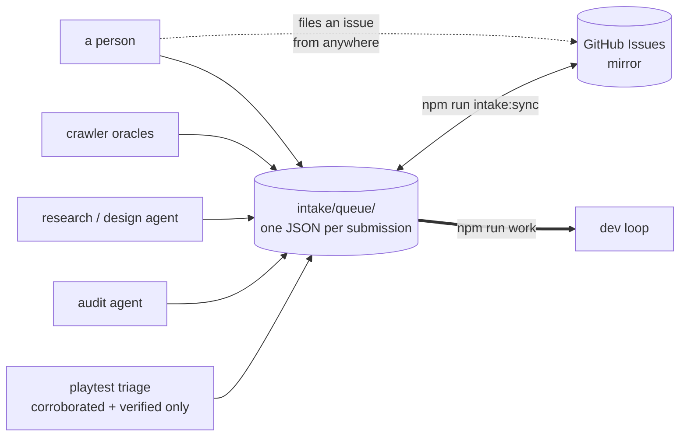

# The two-loop workflow

Two loops run independently and in parallel. Neither waits for the other. **Any model
can run either one.**

```mermaid
flowchart LR
    subgraph DEV["Dev loop — ./loop.sh"]
        A["assess<br/>QA bucket first, then candidates"] --> B["crawl:smoke gate"]
        B --> C["one focused change"]
        C --> D["provisional commit"]
        D --> E["crawl · health · verifier integrity"]
        E --> F["seal + push"]
    end

    F ==>|"a new build"| BUILD[("published build")]

    subgraph QA["Playtest loop — ./playtest-loop.sh"]
        G["cohort: many cheap players<br/>+ a few reference players"]
        G --> H["session records<br/>nothing thrown away"]
        H --> I["triage → clusters → promotion"]
    end

    BUILD ==> G
    I ==>|"corroborated + verified only"| BUCKET[("qa/tickets/")]
    BUCKET ==> A

    classDef gate fill:#dcefe2,stroke:#3f8a5c,color:#14402a
    classDef pool fill:#dde7f2,stroke:#3d6b96,color:#16212b
    class B,E gate
    class BUILD,BUCKET,H pool
```



## Why they are split

The old single loop spent most of its wall clock blocked. Each cycle made one change,
then stopped and waited for one blind playthrough of that exact commit before it could
land anything. Throughput was capped at roughly one change per playtest.

That coupling existed because a single playtest was doing two jobs at once:

| Job                                                       | Wants                      | Needs to be commit-bound? |
| --------------------------------------------------------- | -------------------------- | ------------------------- |
| **Regression gate** — did my change break the experience? | to be fast and blocking    | yes                       |
| **Quality survey** — where does the game actually hurt?   | volume and model diversity | **no**                    |

The survey was paying the gate's tax. Splitting them lets the survey run at whatever
scale you can afford while the dev loop runs at full speed against a purely mechanical
bar.

**The dev loop no longer plays the game.** Its gate is `crawl:smoke`, `npm run health`,
and the verifier-integrity drift check — the same bar as before, minus the playtest.

## Any model, either loop

The dev loop is genuinely vendor-neutral. The playtest loop is neutral in everything
except how it PROVES blindness — see the constraint below before planning a cohort.

**Dev loop.** `loop.sh` auto-detects the first installed agent in `DEV_AGENT_IDS`
(`codex`, `claude`, `gemini`). Pick one with `AI_AGENT=<id>`, or point
`AI_AGENT_CMD` at anything at all. The full contract an agent must meet:

1. reads its instructions from **STDIN**
2. can create and edit files in `$PWD` and run the repo's commands
3. runs non-interactively, with no approval prompt
4. exits 0 on success, nonzero on failure

Anything meeting that works, listed or not.

**Playtest loop.** Providers live in `src/blind/providers.ts`; the models each one may
play as live in operator-owned catalogs under `blind-tester/catalogs/`. Adding a vendor
is one registry entry plus one catalog file — no runner, store, triage, or ranking code
learns a vendor's name.

```bash
npm run qa:bucket -- --summary              # what the dev loop can pick up
AI_AGENT=claude ./loop.sh                   # dev loop on Claude Code
PLAYTEST_COHORT="codex:8" ./playtest-loop.sh
```

### Vendor privilege is now derived, not declared

**No vendor is named anywhere in the gate.** Whether a provider may produce a
`runner_enforced` session is computed, per provider, from two facts about this checkout:

| Question                                        | Answered by                                              | Where it lives                               |
| ----------------------------------------------- | -------------------------------------------------------- | -------------------------------------------- |
| Can this vendor's blindness be **proven** here? | it declares a `capture` block whose reader module exists | `blind-tester/providers.json` + the reader   |
| Can `run.sh` actually **launch** it?            | its reader is in the implemented list                    | `blind-tester/implemented-launch-paths.json` |

Both must hold. `derivePlaytestIsolation()` in `src/blind/providers.ts` answers the first
and `runnerCanDriveProvider()` combines them; `blind-tester/run.sh`, `bin/doctor.ts`,
`playtest-loop.sh` and `blind-tester/resolve-provider.mjs` all read those same two
answers, so none of them can advertise a lane another one refuses. The registry's stored
`isolation` literal survives only as a second witness: if it disagrees with what the
checkout derives, the registry **fails to parse**. A vendor cannot be talked into the
strong label by editing JSON.

That matters more than it sounds. `bin/record-playtest-session.ts` seals the isolation
label onto a corpus record, and the ranking layer lets `runner_enforced` sessions move
experience metrics. A provider stamped with a label the runner cannot back is the
contamination `src/blind/providers.ts` calls the worst error available in that file —
so the recorder now downgrades to `operator_attested`, loudly, for any provider this
checkout cannot actually drive. The weaker path requires explicit `--attested-by` and
`--method` values and fails before writing if either is absent; it never manufactures
an attestation to make the schema pass.

Adding a vendor is therefore five mechanical steps, none of which is "edit a gate":
a registry entry, a `capture` block, a reader module, a launch branch in `run.sh`, and
one line in `implemented-launch-paths.json`. The first three make its evidence honest;
the last two make it runnable. `npm run doctor` prints exactly which of the five are
missing, per provider, in this checkout.

**Today that yields: codex and claude_code both live in the generic runner
(`blind-tester/claude-session.mjs` has its launch branch and its line in the
implemented list); gemini_cli ingest-only; and grok_cli available through its own
operator-attested headless wave.** The Claude Code lane launches with
`--strict-mcp-config` plus `--tools ""` plus `--setting-sources ""` — a process whose
entire callable surface is the one declared MCP server — with a runner-pinned
`--session-id` naming the transcript path before launch, and audits both the
offered surface (the stream's init event) and the called one (the transcript).

The remaining asymmetry is capability, not policy. `runner_enforced` means the runner
PROVED the agent saw only the AdventureForge MCP tools, and for Codex that proof is read
out of its own rollout logs by `blind-tester/codex-rollout.mjs` (1,566 lines) plus
`codex-process-anchor.mjs`, `codex-pure-envelope.mjs` and `codex-strict-stream.mjs`.
Writing the equivalent for another vendor is now a contained job — the seam takes it —
rather than a change to five files and a gate.

What this does and does not cost you while a vendor still lacks a launch path:

- Multi-vendor **bug corroboration works today**. `operator_attested` sessions count
  toward it, and corroboration across families is the promotion rung that matters.
- Multi-vendor **experience metrics do not**. Retention and clarity numbers take
  `runner_enforced` sessions only, so headline experience numbers remain a measurement
  of whichever vendors are live in this checkout — currently Codex and Claude Code.

So a mixed fleet is worth running now: drive not-yet-launchable vendors through their
own client and ingest them, or use the dedicated Grok wave. Read headline experience
numbers as belonging only to runner-enforced vendors until equivalent capture readers
and launch paths land.

### Cheap by default, expensive on purpose

The game does not need frontier reasoning to be _played_. It needs **volume**, because
experiential findings only become trustworthy through repetition across independent
instruments.

So the fleet is deliberately lopsided. A large **`volume`** cohort supplies throughput.
A small **`reference`** cohort — three or so expensive, high-reasoning players — runs
alongside as a _calibration instrument_. Its job is not to find more bugs; it is to tell
you whether the cheap cohort's silence means anything.

Three readings, treated asymmetrically by both `derivePromotion` and `scoreCluster`:

| Who reported it     | Reading                          | Effect   |
| ------------------- | -------------------------------- | -------- |
| both tiers          | real, high confidence            | ×2       |
| **reference only**  | the cheap cohort is blind to it  | **×1.5** |
| volume, ≥2 lineages | independent agreement            | ×1       |
| volume, 1 lineage   | suspect a model capability floor | ×0.5     |

The reference-only weighting is the important one. Such a finding arrives with a tiny
mention count — three runs against forty — so under plain count×severity it sorts near
the bottom and the calibration instrument gets outvoted by the very cohort it exists to
check.

Equally, forty runs of one cheap model agreeing is **one instrument sampled forty
times**, not forty witnesses. Ranking counts **distinct lineages**; repetition within a
lineage still counts, but saturates (`1 + log₂(1 + n)`), so a 200-run cohort cannot bury
a 3-run finding that four vendors confirmed.

## Blindness: two honest evidence classes

| Class               | How it is established                                                                      | Counts toward bug corroboration | Counts toward experience metrics |
| ------------------- | ------------------------------------------------------------------------------------------ | ------------------------------- | -------------------------------- |
| `runner_enforced`   | the runner owns argv, cwd and the tool allowlist, and records proof                        | yes                             | yes                              |
| `operator_attested` | operator/harness records the intended client boundary, without an auditable capture reader | yes                             | **no**                           |

Vendors the generic runner cannot prove are played through their own client and recorded
with `npm run playtest:ingest`; the attestation naming who vouched is **required**.
Grok Build is the one dedicated exception to the manual launch shape: its headless wave
starts a private pure server per player and verifies the server's session, seed, build,
and exact receipt, but still records the client as `operator_attested` because no Grok
capture reader proves the complete offered tool surface. This keeps the corpus maximally
inclusive without letting unverifiable client runs quietly move a headline quality
number, which is the contamination the `BLIND_AGENT_CMD` ban has always existed to
prevent.

## Nothing is thrown away

Every playthrough becomes a session record: date and time, provider, model, model
settings, persona/role, the full playthrough log, and the exit interview. Crashed,
abandoned, timed-out and malformed runs are recorded too — a player who gave up is
telling you something a finished playthrough cannot.

Records are **content-addressed** (`record_id` = SHA-256 of the record's own content),
so mass-parallel cohorts on different machines under different vendors can all write to
one corpus with no lock, no queue, and no coordinator: identical content is the same
file, different content is a different file, and there is never a merge.

The corpus stages under `ai-runs/playtest/` (gitignored, because a dev loop whose
worktree is never clean cannot take a provisional commit) and is published to its own
`playtest-sessions` branch by `npm run qa:publish`, using git plumbing with a temporary
index so it never touches the working tree.

## Intake: every way work reaches the dev loop

**Playtest feedback is not the only way the game changes.** An audit agent finds a
structural problem; a research agent proposes a mechanic; the crawler files a softlock; a
person wants a feature. All of them file the same thing — a **submission** — into one
queue, `intake/queue/`, and the dev loop reads only that.



| Source     | Files when                                  | Default priority                    |
| ---------- | ------------------------------------------- | ----------------------------------- |
| `crawler`  | an invariant oracle trips                   | P0                                  |
| `playtest` | triage corroborates or reproduces           | from severity, lifted if reproduced |
| `human`    | a person asks                               | P1                                  |
| `audit`    | an agent reviews the repo or game           | P2                                  |
| `research` | an agent proposes a change nobody asked for | P3                                  |

**Priority is not severity.** Severity says how bad it is; priority says when we do it. A
cosmetic defect on the opening screen can outrank a severe one in content nobody reaches.

### Filing

```bash
npm run submit -- --source audit --kind refactor \
  --title "OverworldSession is a 4,000-line stateful class" \
  --body-file finding.md --area src/world/session.ts --ref docs/REPO_AUDIT_2026-08.md

cat plan.md | npm run submit -- --source research --kind feature --title "..." --body -
```

Re-filing is safe and expected. A submission's id is content-addressed on
`source + kind + key`, so an agent that re-runs nightly **updates its own submissions
instead of filing a hundred duplicates** — and lifecycle state the queue owns (`status`,
and the issue it is mirrored to) survives a re-file, so re-filing never resets something a
dev agent is already working.

### GitHub Issues is a mirror, not the source of truth

People should file requests in the tool they already have — labels, search, notifications,
a phone app. But the loop must keep working when the network is down or a token expires,
so the canonical copy is the files and `npm run intake:sync` reconciles both ways:

- **push** — every local submission gets or updates its issue
- **pull** — every issue _without_ a marker becomes a `human` submission; issue state
  comes back, so closing an issue in the GitHub UI closes the work here

Idempotency comes from a marker in the issue body — `<!-- af-submission-id: … -->` — so
re-syncing updates the issue it already has. Matching on titles instead would fork one
item into two the first time somebody reworded it.

If `gh` is missing or logged out, sync says exactly which and **exits 0**. An outage in a
mirror is not an outage in the work.

### Reading

```bash
npm run work                      # the one thing to build next
npm run work -- --list            # the whole open queue, in order
npm run work -- --claim <id>      # in_progress
npm run work -- --done <id>       # done
```

## How feedback becomes work

Modelled on how a QA organization actually runs, not on a benchmark:

- A tester does not file a P1. They file a **report**.
- **Triage** decides what is a bug, what is one player's taste, and what duplicates
  something already open.
- A report becomes actionable through **corroboration** (several independent lineages) or
  **reproduction** (the deterministic crawler, or a maintainer).
- Everything filed is kept, whether or not it is ever actioned.

Promotion ladder — only the top two rungs cross into the dev loop's queue:

| Rung           | Meaning                                                                                                       |
| -------------- | ------------------------------------------------------------------------------------------------------------- |
| `verified`     | reproduced by something with no opinion. Outranks any amount of agreement.                                    |
| `corroborated` | ≥2 distinct lineages, or reference-tier confirmation.                                                         |
| `accumulating` | seen and recorded, not yet independently supported. **Not a rejection** — the resting state of most feedback. |

An `accumulating` ticket stays visible in `qa/tickets/` but never reaches the queue.
Handing the dev loop a pile of single-report opinions is exactly what the corroboration
rule exists to prevent.

### Staleness

Floating the survey free of the commit introduced one genuinely new failure mode:
findings acquire an age. A ticket last seen more than `STALE_AFTER_BUILDS` (8) builds ago
drops out of view rather than sending the loop chasing something already fixed. It is
marked `stale`, never deleted, and any fresh report revives it. Verified tickets never
decay — a reproduction does not stop being true because nobody happened to hit it again.

## Runbook: four terminals on one machine

### Preflight, once

`loop.sh` needs `/proc/<pid>/stat` for pid identity and **fails closed** without it —
a pid alone is not an identity, so it records the pid plus field 22 (the process start
tick) and refuses to start where it cannot read both. Check with:

```bash
cat /proc/$$/stat | head -c 40      # prints something? you're fine
```

On Windows this does **not** require WSL: Git Bash (MSYS2/MINGW64) provides
`/proc/<pid>/stat` with a field 22 that is stable for the life of a process and
distinct between processes, which is exactly the property the guard depends on.
Verify it on your own shell with the command above before reaching for WSL — and
prefer Git Bash if the repo lives on the Windows filesystem, since driving `C:\dev`
through `/mnt/c` from WSL is markedly slower.

Four loops in one directory will fight — the dev loop hard-resets the tree on a failed
cycle, and a player mid-run would be playing a build that no longer exists.
`playtest-loop.sh` refuses to start beside a live dev loop for exactly that reason. Give
each its own worktree; they share the object store, so it is nearly free:

```bash
cd /c/dev/zork-unlimited
# NOT `git worktree add ../af-qa-a main` — that is refused, because main is already
# checked out here. Each worktree needs its own branch off the same commit.
git worktree add -b qa-a ../af-qa-a origin/main
git worktree add -b qa-b ../af-qa-b origin/main
git worktree add -b qa-c ../af-qa-c origin/main
mkdir -p /d/af-corpus            # ONE shared session corpus, outside every worktree
```

Two things to do before the first launch, both of which cost you a wave otherwise:

- **Junction `node_modules` into each worktree.** `playtest-loop.sh` runs a full
  `npm install` in any worktree that lacks one. From an elevated PowerShell:
  `New-Item -ItemType Junction -Path C:\dev\af-qa-a\node_modules -Target C:\dev\zork-unlimited\node_modules`
  (repeat per worktree).
- **Exclude the corpus directory from Defender.** `writePlaytestSession` finalises a
  session by renaming its staging directory, and on Windows that fails with `EPERM`
  while any process holds a handle inside it — a real-time scan of the transcript is
  exactly that. The recorder then prints one line and moves on, so the session is lost
  from the corpus with no other trace. `C:\dev` is already excluded; a corpus on
  another volume is not.

The dev-loop refusal is worth understanding precisely, because it is weaker than it
reads: it is a bare `-f ai-runs/loop.pid` existence test relative to the script's own
checkout. `ai-runs/` is gitignored and therefore per-worktree, so a dev loop in one
worktree is invisible to a playtest loop in another — the guard does not police
worktrees, and it is not a multi-instance lock either. It also never clears itself if
the dev loop is killed with `taskkill` or by closing the terminal: the file survives and
that checkout then refuses every playtest loop forever. Clear it with
`scripts/loop-stop.sh`, or `rm -f ai-runs/loop.pid`.

### Preflight, part one and a half: ask what this machine can actually do

```bash
npm run doctor -- --store /d/af-corpus
```

It reports which agent the dev loop will pick, which vendors can run live here versus
which must be hand-played and ingested, what shape the corpus is in, and — the part that
matters — **why nothing is queued, when nothing is queued**. "Nothing promoted" is the
correct outcome for a single-vendor corpus and also the symptom of a broken pipeline;
those look identical from outside, and this names which one you have. Read-only.

### Preflight, part two: prove the wiring before you spend a cohort

Every other way to find out whether a cohort string, a model pin or a store path is
right costs a vendor a real cohort of tokens. `PLAYTEST_MOCK=1` runs the loop end to end
against `run.sh`'s bundled scripted agent instead — no model, no tokens:

```bash
PLAYTEST_MOCK=1 \
PLAYTEST_COHORT="gemini_cli:2,codex:1" \
PLAYTEST_STORE=/d/af-corpus \
./playtest-loop.sh --once
```

A healthy run dispatches every player, writes each one's artifacts, and records
**nothing**:

```
  ▸ codex seed=600 persona=default
    (wiring check — not recorded; log at ai-runs/playtest/logs/codex_seed600_default.runner.log)
  corpus: 0 session(s); none; lineages none
```

Recording nothing is the point, not a failure. A scripted agent has no opinion, and
filing its canned exit interview would let three mock runs read as three vendors
agreeing. If a player reports a nonzero exit instead, read the named log — the wiring is
wrong and a real cohort would have failed the same way.

### Terminal 1 — dev loop

```bash
cd /d/zork-unlimited
AI_AGENT=claude \
AI_LOOP_TRIAGE_STORE=/d/af-corpus \
AI_LOOP_COMMIT=1 AI_LOOP_PUSH=1 \
./loop.sh
```

`AI_LOOP_TRIAGE_STORE` is what makes several QA worktrees work without syncing anything:
triage is pure over the corpus, so the dev loop re-derives the queue itself at cycle
start. Add `AI_LOOP_IDLE_WHEN_EMPTY=1` if you would rather it wait for real work than fall
back to assessor candidates.

### Terminals 2–4 — QA loops

```bash
cd ../af-qa-a
PLAYTEST_STORE=/d/af-corpus \
PLAYTEST_COHORT="codex:12" \
PLAYTEST_CONCURRENCY=8 \
./playtest-loop.sh
```

Two constraints the preflight now enforces up front, so a wave refuses instead of
dispatching doomed players: the cohort may name only vendors this checkout can both
prove blind and launch (`npm run doctor` prints the current table — today that is
`codex` and `claude_code`; a `gemini_cli` cohort is refused with the ingest
alternative), and live waves accept only the `default` persona — persona-directed
play changes the thing retention measures. Rotate personas on the structural lanes
instead (`PLAYTEST_MOCK=1`, or `npm run fleet:mock -- --personas ...`).

Vary the cohort per terminal — `codex:10`, `claude_code:10` — and pin the reference tier
on **exactly one**:

```bash
PLAYTEST_MODELS="codex=gpt-5.6-terra" PLAYTEST_COHORT="codex:8,codex:2"
```

Three expensive players total, not thirty. The reference cohort is a calibration
instrument, not a second opinion.

A worked, verified volume wave (2026-08-31: 100/100 recorded in ~65 minutes at
~$2 nominal and ~3.5 minutes per player, corpus metrics-eligible went 0 → 80):

```bash
git worktree add ../zork-wave -b wave/<label> origin/main
cd ../zork-wave
PLAYTEST_STORE="C:/dev/zork-unlimited/ai-runs/playtest/sessions" \
PLAYTEST_COHORT="claude_code:100" \
PLAYTEST_MODELS="claude_code=claude-sonnet-5" \
PLAYTEST_CONCURRENCY=10 \
PLAYTEST_MAX_WAVES=1 \
./playtest-loop.sh --once
```

The absolute `PLAYTEST_STORE` pools every worktree's sessions into one corpus
(content addressing needs no lock), and concurrency 10 kept a consumer
subscription under its rate limits; `npm run doctor` afterward shows the
eligibility flip.

### What each agent is actually for

The orchestrator model in each terminal is a **supervisor, not the fan-out mechanism**.
`playtest-loop.sh` forks OS processes directly, so a frontier model sits there burning
almost no tokens while a dozen cheap players run. Its job is to notice when players fail
for harness reasons rather than game reasons, and fix the harness.

### Grok

Grok Build ships a headless CLI. The dedicated instant-thinking lane targets
`grok-4.6` at `reasoning_effort=low`, launches each player with only Grok's
`search_tool`/`use_tool` built-ins, and gives it a private pure AdventureForge MCP
server. Inspect the deterministic plan without spending, then launch only from a clean
tracked revision:

```bash
npm run playtest:grok-wave -- --plan-only
npm run playtest:grok-wave -- --count 100 --concurrency 4
```

Each completed report must match the server's V2 evidence for game session, seed, build,
world, and receipt. The ignored manifest is updated after every player so partial waves
remain diagnosable. Any incomplete member makes the command exit nonzero. The sessions
are nevertheless `operator_attested`: the server evidence proves what game was played,
not that the Grok client was offered no unrelated MCP tools. They count toward bug
corroboration and remain excluded from experience metrics.

Desktop/web sessions still use the manual path:

```bash
npm run playtest:ingest -- --provider grok_desktop --model grok-4.6 \
  --persona cynical_veteran --seed 1234 --game-session-id o-… \
  --transcript run.jsonl --report report.md \
  --attested-by "you" --method "desktop client, AdventureForge MCP only"
```

## Acceptance test: is the two-loop system actually working?

Everything below the corpus can be verified locally; the one thing that cannot is whether
two DIFFERENT vendors' prose describing one defect clusters together. Corroboration is
the rung this whole split exists to reach, so it is worth proving once deliberately
rather than inferring it from a quiet queue.

```bash
npm run doctor -- --store /d/af-corpus     # 1. what this machine can launch
PLAYTEST_MOCK=1 PLAYTEST_COHORT="codex:2" PLAYTEST_STORE=/d/af-corpus \
  ./playtest-loop.sh --once                # 2. wiring, zero tokens, records nothing
PLAYTEST_COHORT="codex:2" PLAYTEST_STORE=/d/af-corpus ./playtest-loop.sh --once
                                           # 3. two real Codex players
# 4a. one evidence-bound Grok player on the same clean revision:
npm run playtest:grok-wave -- --count 1 --concurrency 1 --store /d/af-corpus
# Or 4b. play once in Gemini's own client, then:
npx tsx bin/ingest-playtest-session.ts --provider gemini_cli --model <id> \
  --attested-by "<you>" --method "desktop client, AdventureForge MCP only" \
  --transcript run.jsonl --report report.md --store /d/af-corpus
npm run doctor -- --store /d/af-corpus     # 5. the verdict
```

**Pass** is step 5 reporting both selected model families (`gpt` plus `grok` or
`gemini`) and `The dev loop has work`, with the item visible in
`npm run work -- --list`. That means a finding two independent vendors hit travelled
the whole way to the dev loop on its own.

**A stall is not automatically a failure.** If the doctor says `Add a SECOND model family`
you only have one lineage in the corpus — step 4 did not land. If it says tickets exist
but none is actionable while both families ARE present, the two vendors described
different things, which is ordinary. If it reports many tickets across three or more
sessions with nothing merged at all, that is the shape of a clustering fault and worth
investigating rather than accepting.

Two things that will bite if you skip the doctor:

- **Only `codex` and `claude_code` run live through `playtest-loop.sh`.** Every other
  vendor is refused there with `cannot produce pure evidence`, because runner-enforced
  blindness is proved from the client's own session log and only those two have capture
  readers in this checkout (`blind-tester/implemented-launch-paths.json` is the list;
  `npm run doctor` explains every provider's status). Grok's separate headless command
  and manually ingested sessions still count toward bug corroboration, but remain
  operator-attested.
- **A report that does not verify is kept but contributes nothing.** The ingest command
  now says so explicitly and names the reason; if you see that line, fix the report and
  re-run rather than assuming the session landed as evidence.

## Commands

| Command                                | What it does                                         |
| -------------------------------------- | ---------------------------------------------------- |
| `npm run doctor`                       | what works here, and why nothing is queued           |
| `./loop.sh`                            | dev loop; any installed agent                        |
| `./playtest-loop.sh`                   | playtest loop; cohorts across providers and personas |
| `npm run work`                         | the next thing to build                              |
| `npm run submit -- …`                  | file work from any source                            |
| `npm run intake:sync`                  | reconcile the queue with GitHub Issues               |
| `npm run qa:bucket -- --summary`       | the playtest ticket bucket                           |
| `npm run qa:bucket -- --store-summary` | the session corpus                                   |
| `npm run qa:triage`                    | re-triage the corpus (pure; safe to re-run)          |
| `npm run qa:publish`                   | push the session corpus to its branch                |
| `npm run playtest:record -- …`         | seal one finished run into the corpus                |
| `npm run playtest:ingest -- …`         | record any session the runner did not launch         |
| `npm run playtest:grok-wave -- …`      | evidence-bound, operator-attested Grok Build batch   |
