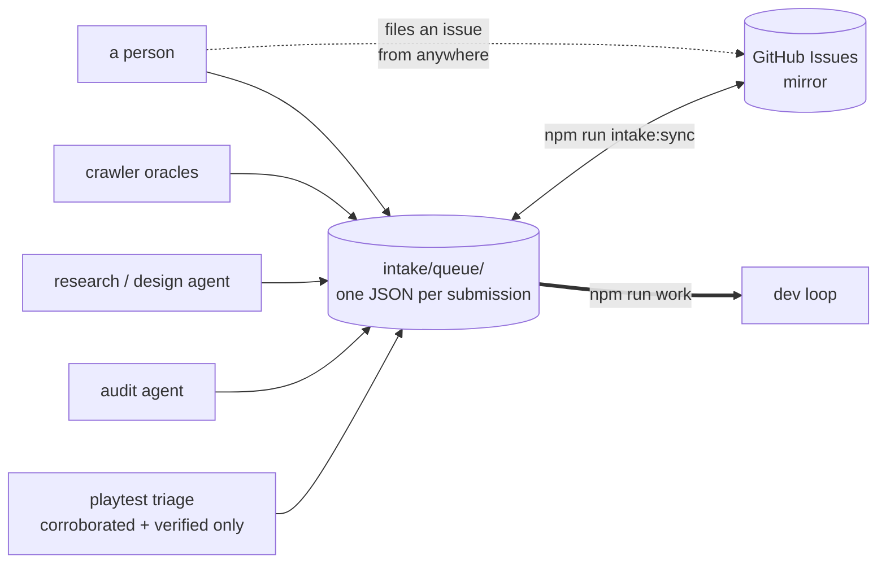

# The two-loop workflow

Two loops run independently and in parallel. Neither waits for the other. **Any model
can run either one.**

```mermaid
flowchart LR
    subgraph DEV["Dev loop — ./loop.sh"]
        A["assess<br/>QA bucket first, then candidates"] --> B["crawl:smoke gate"]
        B --> C["one focused change"]
        C --> D["provisional commit"]
        D --> E["crawl · health · verifier integrity"]
        E --> F["seal + push"]
    end

    F ==>|"a new build"| BUILD[("published build")]

    subgraph QA["Playtest loop — ./playtest-loop.sh"]
        G["cohort: many cheap players<br/>+ a few reference players"]
        G --> H["session records<br/>nothing thrown away"]
        H --> I["triage → clusters → promotion"]
    end

    BUILD ==> G
    I ==>|"corroborated + verified only"| BUCKET[("qa/tickets/")]
    BUCKET ==> A

    classDef gate fill:#dcefe2,stroke:#3f8a5c,color:#14402a
    classDef pool fill:#dde7f2,stroke:#3d6b96,color:#16212b
    class B,E gate
    class BUILD,BUCKET,H pool
```



## Why they are split

The old single loop spent most of its wall clock blocked. Each cycle made one change,
then stopped and waited for one blind playthrough of that exact commit before it could
land anything. Throughput was capped at roughly one change per playtest.

That coupling existed because a single playtest was doing two jobs at once:

| Job                                                       | Wants                      | Needs to be commit-bound? |
| --------------------------------------------------------- | -------------------------- | ------------------------- |
| **Regression gate** — did my change break the experience? | to be fast and blocking    | yes                       |
| **Quality survey** — where does the game actually hurt?   | volume and model diversity | **no**                    |

The survey was paying the gate's tax. Splitting them lets the survey run at whatever
scale you can afford while the dev loop runs at full speed against a purely mechanical
bar.

**The dev loop no longer plays the game.** Its gate is `crawl:smoke`, `npm run health`,
and the verifier-integrity drift check — the same bar as before, minus the playtest.

## Any model, either loop

Nothing in this repo privileges a vendor.

**Dev loop.** `loop.sh` auto-detects the first installed agent in `DEV_AGENT_IDS`
(`codex`, `claude`, `gemini`). Pick one with `AI_AGENT=<id>`, or point
`AI_AGENT_CMD` at anything at all. The full contract an agent must meet:

1. reads its instructions from **STDIN**
2. can create and edit files in `$PWD` and run the repo's commands
3. runs non-interactively, with no approval prompt
4. exits 0 on success, nonzero on failure

Anything meeting that works, listed or not.

**Playtest loop.** Providers live in `src/blind/providers.ts`; the models each one may
play as live in operator-owned catalogs under `blind-tester/catalogs/`. Adding a vendor
is one registry entry plus one catalog file — no runner, store, triage, or ranking code
learns a vendor's name.

```bash
npm run qa:bucket -- --summary              # what the dev loop can pick up
AI_AGENT=claude ./loop.sh                   # dev loop on Claude Code
PLAYTEST_COHORT="gemini_cli:8,codex:2" ./playtest-loop.sh
```

### Cheap by default, expensive on purpose

The game does not need frontier reasoning to be _played_. It needs **volume**, because
experiential findings only become trustworthy through repetition across independent
instruments.

So the fleet is deliberately lopsided. A large **`volume`** cohort supplies throughput.
A small **`reference`** cohort — three or so expensive, high-reasoning players — runs
alongside as a _calibration instrument_. Its job is not to find more bugs; it is to tell
you whether the cheap cohort's silence means anything.

Three readings, treated asymmetrically by both `derivePromotion` and `scoreCluster`:

| Who reported it     | Reading                          | Effect   |
| ------------------- | -------------------------------- | -------- |
| both tiers          | real, high confidence            | ×2       |
| **reference only**  | the cheap cohort is blind to it  | **×1.5** |
| volume, ≥2 lineages | independent agreement            | ×1       |
| volume, 1 lineage   | suspect a model capability floor | ×0.5     |

The reference-only weighting is the important one. Such a finding arrives with a tiny
mention count — three runs against forty — so under plain count×severity it sorts near
the bottom and the calibration instrument gets outvoted by the very cohort it exists to
check.

Equally, forty runs of one cheap model agreeing is **one instrument sampled forty
times**, not forty witnesses. Ranking counts **distinct lineages**; repetition within a
lineage still counts, but saturates (`1 + log₂(1 + n)`), so a 200-run cohort cannot bury
a 3-run finding that four vendors confirmed.

## Blindness: two honest evidence classes

| Class               | How it is established                                               | Counts toward bug corroboration | Counts toward experience metrics |
| ------------------- | ------------------------------------------------------------------- | ------------------------------- | -------------------------------- |
| `runner_enforced`   | the runner owns argv, cwd and the tool allowlist, and records proof | yes                             | yes                              |
| `operator_attested` | a human asserts the client had only the AdventureForge MCP tools    | yes                             | **no**                           |

Vendors with no headless CLI — Grok today — are played through their own client and
recorded with `npm run playtest:ingest`. The attestation naming who vouched is
**required**. This keeps the corpus maximally inclusive without letting unverifiable
runs quietly move a headline quality number, which is the contamination the
`BLIND_AGENT_CMD` ban has always existed to prevent.

## Nothing is thrown away

Every playthrough becomes a session record: date and time, provider, model, model
settings, persona/role, the full playthrough log, and the exit interview. Crashed,
abandoned, timed-out and malformed runs are recorded too — a player who gave up is
telling you something a finished playthrough cannot.

Records are **content-addressed** (`record_id` = SHA-256 of the record's own content),
so mass-parallel cohorts on different machines under different vendors can all write to
one corpus with no lock, no queue, and no coordinator: identical content is the same
file, different content is a different file, and there is never a merge.

The corpus stages under `ai-runs/playtest/` (gitignored, because a dev loop whose
worktree is never clean cannot take a provisional commit) and is published to its own
`playtest-sessions` branch by `npm run qa:publish`, using git plumbing with a temporary
index so it never touches the working tree.

## Intake: every way work reaches the dev loop

**Playtest feedback is not the only way the game changes.** An audit agent finds a
structural problem; a research agent proposes a mechanic; the crawler files a softlock; a
person wants a feature. All of them file the same thing — a **submission** — into one
queue, `intake/queue/`, and the dev loop reads only that.



| Source     | Files when                                  | Default priority                    |
| ---------- | ------------------------------------------- | ----------------------------------- |
| `crawler`  | an invariant oracle trips                   | P0                                  |
| `playtest` | triage corroborates or reproduces           | from severity, lifted if reproduced |
| `human`    | a person asks                               | P1                                  |
| `audit`    | an agent reviews the repo or game           | P2                                  |
| `research` | an agent proposes a change nobody asked for | P3                                  |

**Priority is not severity.** Severity says how bad it is; priority says when we do it. A
cosmetic defect on the opening screen can outrank a severe one in content nobody reaches.

### Filing

```bash
npm run submit -- --source audit --kind refactor \
  --title "OverworldSession is a 4,000-line stateful class" \
  --body-file finding.md --area src/world/session.ts --ref docs/REPO_AUDIT_2026-08.md

cat plan.md | npm run submit -- --source research --kind feature --title "..." --body -
```

Re-filing is safe and expected. A submission's id is content-addressed on
`source + kind + key`, so an agent that re-runs nightly **updates its own submissions
instead of filing a hundred duplicates** — and lifecycle state the queue owns (`status`,
and the issue it is mirrored to) survives a re-file, so re-filing never resets something a
dev agent is already working.

### GitHub Issues is a mirror, not the source of truth

People should file requests in the tool they already have — labels, search, notifications,
a phone app. But the loop must keep working when the network is down or a token expires,
so the canonical copy is the files and `npm run intake:sync` reconciles both ways:

- **push** — every local submission gets or updates its issue
- **pull** — every issue _without_ a marker becomes a `human` submission; issue state
  comes back, so closing an issue in the GitHub UI closes the work here

Idempotency comes from a marker in the issue body — `<!-- af-submission-id: … -->` — so
re-syncing updates the issue it already has. Matching on titles instead would fork one
item into two the first time somebody reworded it.

If `gh` is missing or logged out, sync says exactly which and **exits 0**. An outage in a
mirror is not an outage in the work.

### Reading

```bash
npm run work                      # the one thing to build next
npm run work -- --list            # the whole open queue, in order
npm run work -- --claim <id>      # in_progress
npm run work -- --done <id>       # done
```

## How feedback becomes work

Modelled on how a QA organization actually runs, not on a benchmark:

- A tester does not file a P1. They file a **report**.
- **Triage** decides what is a bug, what is one player's taste, and what duplicates
  something already open.
- A report becomes actionable through **corroboration** (several independent lineages) or
  **reproduction** (the deterministic crawler, or a maintainer).
- Everything filed is kept, whether or not it is ever actioned.

Promotion ladder — only the top two rungs cross into the dev loop's queue:

| Rung           | Meaning                                                                                                       |
| -------------- | ------------------------------------------------------------------------------------------------------------- |
| `verified`     | reproduced by something with no opinion. Outranks any amount of agreement.                                    |
| `corroborated` | ≥2 distinct lineages, or reference-tier confirmation.                                                         |
| `accumulating` | seen and recorded, not yet independently supported. **Not a rejection** — the resting state of most feedback. |

An `accumulating` ticket stays visible in `qa/tickets/` but never reaches the queue.
Handing the dev loop a pile of single-report opinions is exactly what the corroboration
rule exists to prevent.

### Staleness

Floating the survey free of the commit introduced one genuinely new failure mode:
findings acquire an age. A ticket last seen more than `STALE_AFTER_BUILDS` (8) builds ago
drops out of view rather than sending the loop chasing something already fixed. It is
marked `stale`, never deleted, and any fresh report revives it. Verified tickets never
decay — a reproduction does not stop being true because nobody happened to hit it again.

## Runbook: four terminals on one machine

### Preflight, once

`loop.sh` needs `/proc/<pid>/stat` for pid identity and **fails closed** without it. On
Windows, run these under WSL:

```bash
cat /proc/$$/stat | head -c 40      # prints something? you're fine
```

Four loops in one directory will fight — the dev loop hard-resets the tree on a failed
cycle, and a player mid-run would be playing a build that no longer exists.
`playtest-loop.sh` refuses to start beside a live dev loop for exactly that reason. Give
each its own worktree; they share the object store, so it is nearly free:

```bash
cd /d/zork-unlimited
git worktree add ../af-qa-a main
git worktree add ../af-qa-b main
git worktree add ../af-qa-c main
mkdir -p /d/af-corpus            # ONE shared session corpus, outside every worktree
```

### Terminal 1 — dev loop

```bash
cd /d/zork-unlimited
AI_AGENT=claude \
AI_LOOP_TRIAGE_STORE=/d/af-corpus \
AI_LOOP_COMMIT=1 AI_LOOP_PUSH=1 \
./loop.sh
```

`AI_LOOP_TRIAGE_STORE` is what makes several QA worktrees work without syncing anything:
triage is pure over the corpus, so the dev loop re-derives the queue itself at cycle
start. Add `AI_LOOP_IDLE_WHEN_EMPTY=1` if you would rather it wait for real work than fall
back to assessor candidates.

### Terminals 2–4 — QA loops

```bash
cd ../af-qa-a
PLAYTEST_STORE=/d/af-corpus \
PLAYTEST_COHORT="gemini_cli:12" \
PLAYTEST_PERSONAS="default,cynical_veteran,breaker" \
PLAYTEST_CONCURRENCY=8 \
./playtest-loop.sh
```

Vary the cohort per terminal — `codex:10`, `claude_code:10` — and pin the reference tier
on **exactly one**:

```bash
PLAYTEST_MODELS="codex=gpt-5.6-terra" PLAYTEST_COHORT="codex:8,codex:2"
```

Three expensive players total, not thirty. The reference cohort is a calibration
instrument, not a second opinion.

### What each agent is actually for

The orchestrator model in each terminal is a **supervisor, not the fan-out mechanism**.
`playtest-loop.sh` forks OS processes directly, so a frontier model sits there burning
almost no tokens while a dozen cheap players run. Its job is to notice when players fail
for harness reasons rather than game reasons, and fix the harness.

### Grok

No headless CLI ships today, so Grok cannot be a QA loop's provider or an orchestrator
terminal. Play it through the desktop client and ingest the session:

```bash
npm run playtest:ingest -- --provider grok_desktop --model grok-4-fast \
  --persona cynical_veteran --seed 1234 --game-session-id o-… \
  --transcript run.jsonl --report report.md \
  --attested-by "you" --method "desktop client, AdventureForge MCP only"
```

That session is `operator_attested`: kept in full, counted toward corroboration, excluded
from experience metrics.

## Commands

| Command                                | What it does                                         |
| -------------------------------------- | ---------------------------------------------------- |
| `./loop.sh`                            | dev loop; any installed agent                        |
| `./playtest-loop.sh`                   | playtest loop; cohorts across providers and personas |
| `npm run work`                         | the next thing to build                              |
| `npm run submit -- …`                  | file work from any source                            |
| `npm run intake:sync`                  | reconcile the queue with GitHub Issues               |
| `npm run qa:bucket -- --summary`       | the playtest ticket bucket                           |
| `npm run qa:bucket -- --store-summary` | the session corpus                                   |
| `npm run qa:triage`                    | re-triage the corpus (pure; safe to re-run)          |
| `npm run qa:publish`                   | push the session corpus to its branch                |
| `npm run playtest:record -- …`         | seal one finished run into the corpus                |
| `npm run playtest:ingest -- …`         | record a session played through a client with no CLI |
