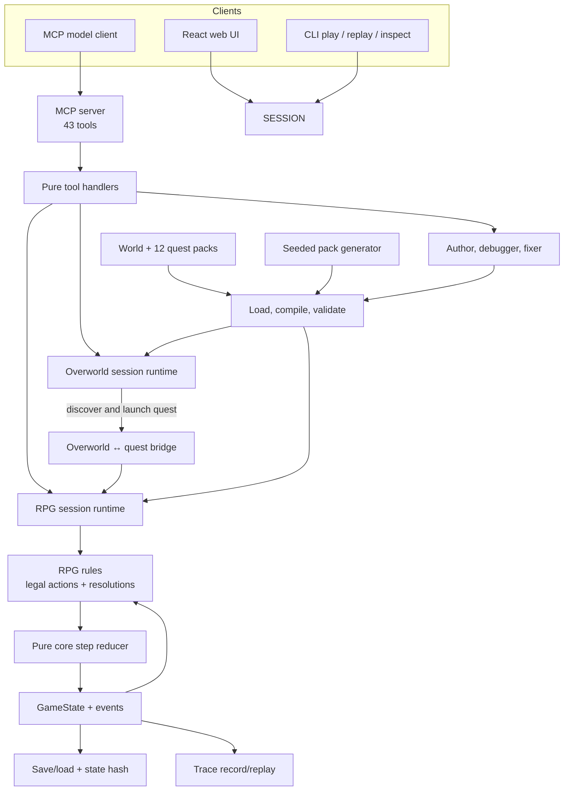
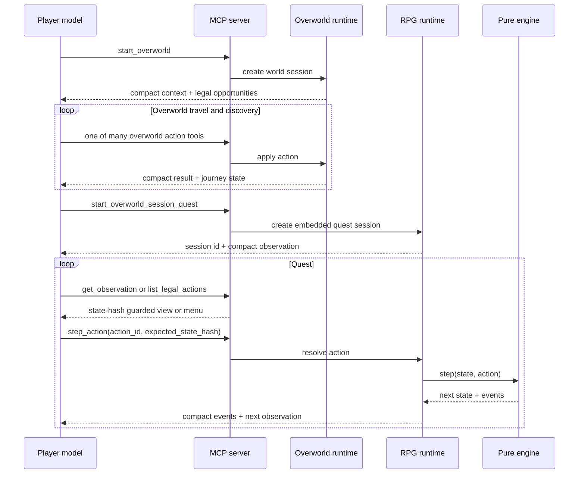
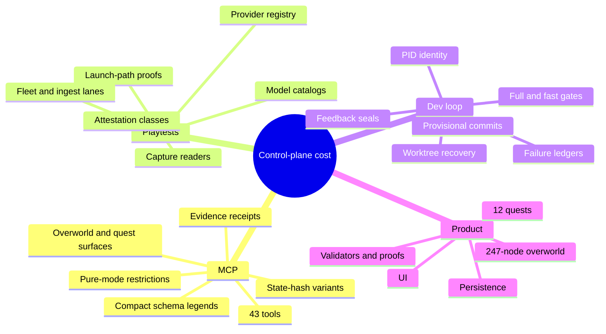
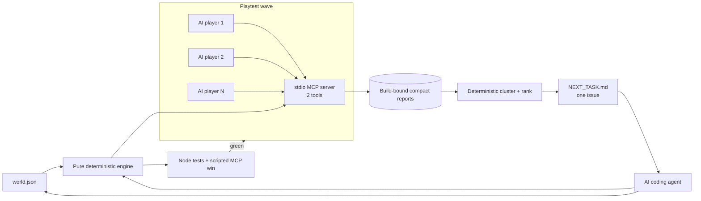
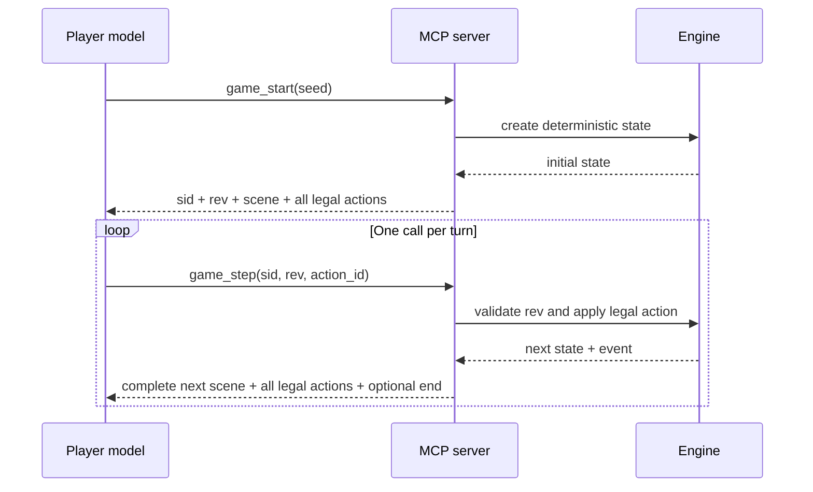
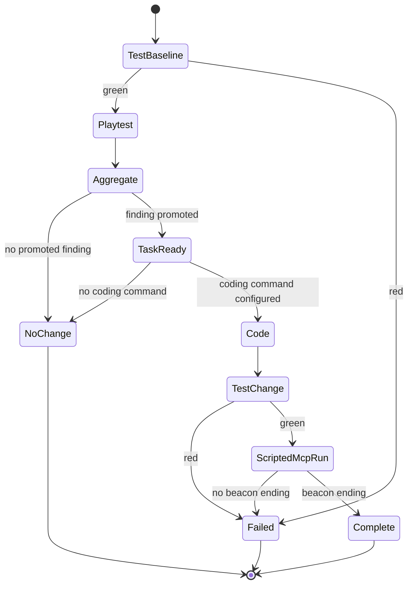

# Zork Unlimited review and lean-loop design

## Finding

The repository is a mature autonomous game-development system. Its complexity is not accidental. It protects determinism, content integrity, playtest provenance, and unattended Git operations.

The fastest small version should not copy that control plane. It should copy four ideas:

1. A deterministic reducer is the source of truth.
2. The MCP server exposes legal choices, not a free-text parser.
3. Playtests produce structured evidence.
4. A coding agent gets one ranked task and must pass a mechanical gate.

## Current repository: runtime map

## Current repository: player call path

## Current repository: autonomous loops

```mermaid
flowchart LR
    subgraph DEV["Development loop"]
        INTAKE[("Intake / QA queue")] --> ASSESS["Assess and select one task"]
        ASSESS --> PRE["Pre-change crawler"]
        PRE --> CODE["Coding agent makes one change"]
        CODE --> FREEZE["Provisional commit"]
        FREEZE --> GATES["Crawler + health + integrity"]
        GATES --> LAND["Seal, commit, optional push"]
    end

    LAND --> BUILD[("Published build")]

    subgraph QA["Independent playtest loop"]
        BUILD --> FLEET["Cheap volume cohort + reference cohort"]
        FLEET --> RECORDS[("Content-addressed session records")]
        RECORDS --> TRIAGE["Verify, cluster, rank, age"]
        TRIAGE --> PROMOTE["Promote corroborated findings"]
    end

    PROMOTE --> INTAKE
```

## What is strong

- The core reducer is pure. It does not use I/O, wall time, or ambient randomness.
- Legal actions are engine data. The UI and MCP layer do not decide game legality.
- Saves, traces, state hashes, validators, crawlers, and exhaustive proofs make failures reproducible.
- The dev loop and playtest loop are separate. A slow player does not block a code change.
- Compact observations, tuple legends, truncation limits, and state-hash guards reduce repeated context.
- Player-only MCP mode blocks authoring, raw state, restore, and direct QA tools.
- Playtest records distinguish strong runner evidence from operator-attested evidence.

## Where the mature system spends complexity

This control plane is useful for a mature product. It is too large for the first fast feedback loop.

## Lean target

The lean version is a `tool-only` MCP application. It has no widget and no free-text command parser.

## Lean MCP sequence

## Lean cycle state machine

## Tool contract

### `game_start`

Input: optional deterministic seed.

Output: an opaque session id, a revision, the current scene, score, inventory, and all legal actions.

### `game_step`

Input: session id, exact revision, and one action id from the prior result.

Output: the complete next scene and all legal actions. It also returns the ending when the game ends.

There is no observe tool. There is no legal-actions tool. There is no transcript tool. There is no raw-state tool.

## Token and latency controls

- The model sees two tool definitions, not 43.
- A turn uses one MCP call.
- The result does not repeat the transcript.
- The result does not expose raw engine state.
- Legal actions use compact `[id, label]` rows.
- The modern tool list is deterministic and cacheable.
- Reports store action ids, ratings, and short findings. They do not store every observation.
- AI action traces are replayed. A false ending or turn count is rejected.
- The aggregator reads only reports for the exact game build hash.
- The coding prompt contains one promoted issue and at most three evidence lines.
- Structural players do not create subjective product findings.

The included sample winning route measures:

| Measure | Result |
| --- | ---: |
| MCP tools | 2 |
| Tool catalog JSON | about 1.4 KB |
| Calls to complete | 11 |
| Mean step result JSON | about 0.4 KB |
| Total result JSON for the route | about 4.5 KB |

These values are JSON byte counts. They are not tokenizer counts.

## Deliberate trade-offs

| Removed from the lean version | Result |
| --- | --- |
| Audited client capture readers | AI-player isolation is instruction-only, but the claimed action trace and outcome are replayed. |
| Provider and model registries | Any MCP-capable command can run, but provenance is weaker. |
| 43 specialized tools | The player has less direct control, but tool choice is simple. |
| Overworld, quest bridge, UI, save/load | The sample proves the loop, not the full product. |
| Exhaustive state-space proofs | Tests are fast, but assurance is lower. |
| Automatic Git reset, commit, PR, and push | The loop cannot damage Git state, but a separate ship step is required. |
| Full transcript corpus | Prompts stay small, but deep replay analysis has less detail. |

## Recommended use

Use this version for early game design and rapid mechanics work. Keep the current AdventureForge system for audited evidence, long campaigns, unattended landing, and mature release control.

A practical migration is incremental:

1. Run the lean loop as an isolated experiment.
2. Use its two-tool contract for a small quest slice.
3. Measure player success, call count, and result bytes.
4. Port only the improvements that remain useful at AdventureForge scale.
5. Keep the existing verifier and provenance system until the lean path proves an equivalent control.
